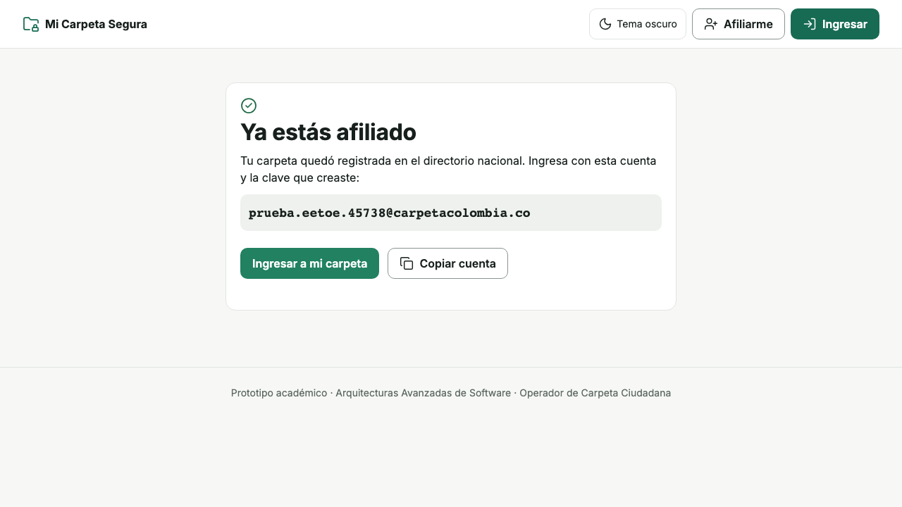
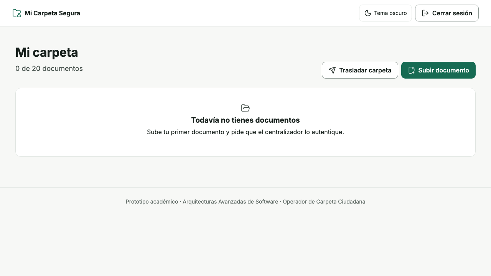
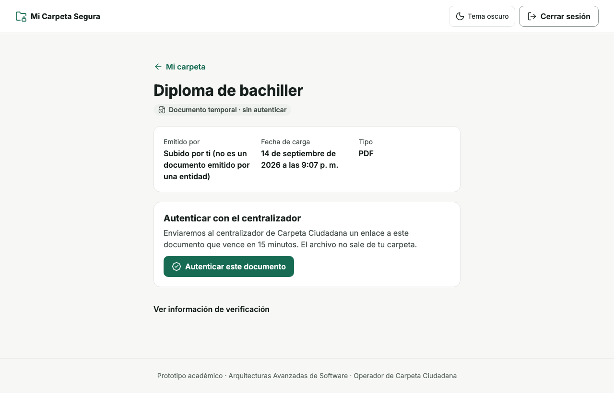
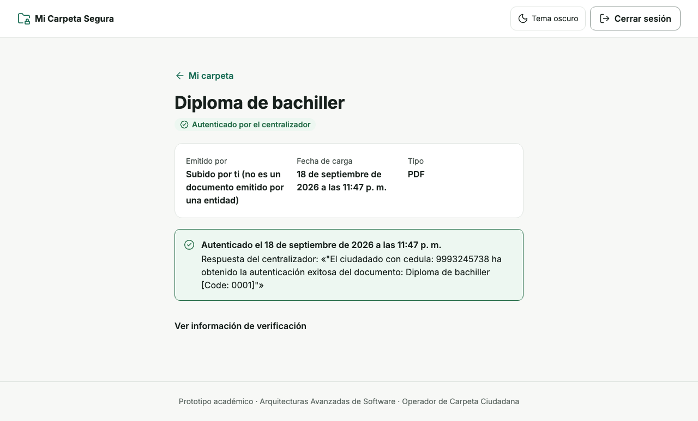

# Carpeta Ciudadana

## Arquitectura del Operador · Entrega 2

|  |  |
|---|---|
| **Documento** | Especificación de arquitectura del operador **Mi Carpeta Segura** |
| **Versión** | 2.1 |
| **Fecha** | 20 de septiembre de 2026 |
| **Autores** | Sergio Junca · Juan José Henao Aristizábal · Samuel Cadavid Zapata — Lead Software Engineers |
| **Preparado para** | Arquitecturas Avanzadas de Software |
| **Docente** | Danny Andrés Salcedo Saldaña |
| **Periodo** | 2026-2 |

Estructura tomada del *Software Requirements Specification Template* del curso, derivado de la *IEEE Guide to Software Requirements Specification* (ANSI/IEEE Std. 830-1984). Los requerimientos que esta arquitectura realiza viven en el SRS v1.0 de la entrega 1, que queda congelado.

---

## Historial de revisiones

| Fecha | Versión | Descripción | Autor | Comentarios |
|---|---|---|---|---|
| 10 sep 2026 | 1.0 | SRS completo en formato ANSI/IEEE Std. 830-1984: 65 requerimientos funcionales, 30 no funcionales, 15 restricciones de diseño y 8 inversos. | Equipo de arquitectura | Entrega 1. Línea base congelada. |
| 14 sep 2026 | 1.1 | Verificación en vivo del contrato de GovCarpeta y registro del operador ante el centralizador. | Equipo de arquitectura | Cierra los bloqueos B-09 y B-16. |
| 18 sep 2026 | 2.0-rc | Arquitectura completa: historias, microservicios, componentes, secuencias, despliegue y doce decisiones en plantilla UAM. | Equipo de arquitectura | Documento extendido de 44 páginas. |
| 20 sep 2026 | 2.0 | Documento de la entrega 2 en el esqueleto del template del curso, con las historias desarrolladas y las decisiones en plantilla UAM completa. | Equipo de arquitectura | Versión entregable. |
| 20 sep 2026 | 2.1 | Cada microservicio declara las historias que realiza, la interfaz que ofrece y las que requiere; se añade el diagrama de paquetes. | Equipo de arquitectura | Atiende la indicación del docente sobre determinar con claridad los microservicios y sus responsabilidades. |

## Aprobación del documento

La siguiente especificación de arquitectura ha sido aceptada y aprobada por:

| Firma | Nombre impreso | Cargo | Fecha |
|---|---|---|---|
|  | Sergio Junca | Lead Software Engineer |  |
|  | Juan José Henao Aristizábal | Lead Software Engineer |  |
|  | Samuel Cadavid Zapata | Lead Software Engineer |  |
|  | Danny Andrés Salcedo Saldaña | Docente, Arquitecturas Avanzadas de Software |  |

---

## Tabla de contenidos

**1. Introducción** — 1.1 Propósito · 1.2 Alcance · 1.3 Definiciones, acrónimos y abreviaturas · 1.4 Referencias · 1.5 Visión general

**2. Descripción general** — 2.1 Perspectiva del producto · 2.2 Funciones del producto · 2.3 Características de los usuarios · 2.4 Restricciones generales · 2.5 Suposiciones y dependencias

**3. Requerimientos específicos** — 3.1 Requerimientos de interfaces externas · 3.2 Requerimientos funcionales · 3.3 Clases y objetos · 3.4 Requerimientos no funcionales · 3.5 Requerimientos inversos · 3.6 Restricciones de diseño · 3.7 Requerimientos lógicos de base de datos · 3.8 Otros requerimientos: despliegue y decisiones de arquitectura

**4. Modelos de análisis** — 4.1 Diagramas de secuencia

**5. Proceso de gestión de cambios**

**A. Apéndices** — A.1 Implementación y evidencia · A.2 Dónde continúa la lectura

---

# 1. Introducción

## 1.1 Propósito

Este documento fija la arquitectura del operador **Mi Carpeta Segura** y demuestra que funciona: cuatro operaciones quedan implementadas contra el centralizador GovCarpeta real. El SRS de la entrega 1 dijo *qué* debe hacer el sistema; aquí se decide *cómo* se reparte en piezas, dónde corren y por qué.

Va dirigido al docente del curso, que evalúa la arquitectura y su trazabilidad hasta los requerimientos; al equipo de desarrollo, que toma de aquí la descomposición en servicios y los contratos; y a los demás operadores de la federación, que necesitan saber por qué interfaz se integran.

## 1.2 Alcance

El producto se llama **Mi Carpeta Segura**. Es el operador de Carpeta Ciudadana que custodia los documentos del ciudadano y lo representa ante el centralizador de MinTIC.

**Implementado en esta entrega.** Registro y afiliación, ingreso, carga de documento temporal y autenticación vía GovCarpeta, de extremo a extremo y sobre Docker Compose local.

**Diseñado, no implementado.** Traslado entre operadores, notificaciones, analítica anonimizada y el módulo Premium. Quedan especificados en *3.3 y *3.8 con su decisión de arquitectura.

**Fuera del documento.** El centralizador de MinTIC no se diseña: es un sistema externo del que solo se consume el contrato, aislado tras una pasarela anticorrupción.

## 1.3 Definiciones, acrónimos y abreviaturas

| Término | Definición |
|---|---|
| Mi Carpeta Segura | Nombre de nuestro operador ante GovCarpeta. |
| GovCarpeta | Centralizador de MinTIC. Registra qué ciudadano pertenece a qué operador y autentica documentos. |
| Pasarela ACL | Capa anticorrupción: el adaptador que traduce el contrato de GovCarpeta a un modelo propio y aísla sus fallos. |
| URL prefirmada | Dirección temporal firmada que da permiso para leer o escribir un objeto del almacén sin entregar credenciales. |
| OIDC | OpenID Connect, el protocolo de identidad sobre el que se autentica el ciudadano. |
| PKCE | *Proof Key for Code Exchange*: prueba criptográfica que impide reutilizar un código OIDC robado desde una aplicación pública. |
| UAM | *Unified Architecture Method*, cuyas plantillas de contexto, entidades y decisión se usan en *2.1, *3.3 y *3.8. |
| Cloud Run | Servicio de Google Cloud que ejecuta contenedores sin administrar servidores y escala a cero. |
| HU / MS / AD | Identificadores de historia de usuario, microservicio y decisión de arquitectura de este documento. |
| RF / RNF / RD / RI / B | Identificadores de requerimiento funcional, no funcional, restricción de diseño, requerimiento inverso y bloqueo, todos del SRS v1.0. |

## 1.4 Referencias

1. *SRS de Carpeta Ciudadana*, versión 1.0, 10 de septiembre de 2026. Equipo de arquitectura. Entrega 1 de este curso.
2. *Caso de estudio: Carpeta Ciudadana*, Arquitecturas Avanzadas de Software, 2026-2.
3. Contrato Swagger de GovCarpeta, leído con peticiones GET el 14 de septiembre de 2026. MinTIC.
4. *Unified Architecture Method* (UAM) V2.1.1, plantillas *System Context*, *Technical Entities* y *Architectural Decision*.
5. Acuerdo de traslado entre operadores del curso: `transferCitizen` y `transferCitizenConfirm`, septiembre de 2026.
6. Documentación oficial de Keycloak 26, Cloud Run, Cloud SQL y Cloud Storage. Google Cloud y Red Hat.
7. *IEEE Guide to Software Requirements Specification*, ANSI/IEEE Std. 830-1984.

## 1.5 Visión general

La sección 2 describe el sistema desde fuera: contexto, funciones, usuarios, restricciones y supuestos heredados del SRS. La sección 3 es el cuerpo del documento: interfaces externas, historias de usuario, descomposición en microservicios y componentes, atributos de calidad, restricciones y las decisiones de arquitectura. La sección 4 recoge los modelos de análisis, que aquí son los diagramas de secuencia. La sección 5 explica cómo cambia este documento. El apéndice A presenta la implementación y su evidencia.

Este documento es autocontenido: trae lo que pide el enunciado de la entrega 2 con su desarrollo completo. El sitio `sjunka.github.io/carpeta-ciudadana/arquitectura` añade los diagramas en versión navegable paso a paso, el mapa técnico explorable y los videos de las secuencias.

# 2. Descripción general

## 2.1 Perspectiva del producto

Mi Carpeta Segura no es un sistema aislado: es un nodo de una federación coordinada por el centralizador de MinTIC. La vista *System Context* de UAM pone a las personas a la izquierda y a los sistemas de TI a la derecha; cada flecha lleva los datos que viajan, no el verbo.

1. Ciudadanos, empresas Premium y analistas del Estado son los actores humanos.
2. GovCarpeta valida y registra la afiliación; la Registraduría confirma identidad, hoy simulada (B-06).
3. Con otros operadores se trasladan ciudadanos, siempre con confirmación explícita.
4. Las entidades emisoras envían documentos ya firmados.

El contenido de los documentos solo viaja entre operadores y hacia el ciudadano. A GovCarpeta llegan datos de afiliación y URLs, nunca documentos (RI-01).

Trazabilidad: RF-01, RF-03, RF-06, RF-07, RF-08, RI-01.

## 2.2 Funciones del producto

El operador afilia ciudadanos garantizando afiliación única, custodia sus documentos, media el consentimiento antes de que un documento salga, se interopera con los demás operadores y representa al ciudadano ante el centralizador. El mapa de historias ordena esas funciones por la actividad del ciudadano y marca el corte del prototipo de esta entrega.

| Actividad | Historias | En esta entrega |
|---|---|---|
| Afiliarse | HU-01, HU-09, HU-13 | Registro implementado; traslado de entrada y salida diseñados. |
| Ingresar y vigilar | HU-02, HU-11 | Ingreso implementado; consulta de accesos diseñada. |
| Guardar documentos | HU-03, HU-04, HU-05, HU-06 | Carga y autenticación implementadas; recepción y descarga diseñadas. |
| Compartir | HU-07, HU-08 | Diseñadas. |
| Generar valor | HU-10, HU-12 | Diseñadas. |

## 2.3 Características de los usuarios

| Usuario | Perfil | Qué exige de la arquitectura |
|---|---|---|
| Ciudadano | Toda la población del país, con apropiación tecnológica muy desigual y dispositivos de gama baja. | Interfaz accesible WCAG 2.1 AA, canales de baja fricción y latencia p95 de 2 s en consulta (RNF-16, RNF-17, RNF-04). |
| Empresa cliente Premium | Operadores de trámites que abren casos PQRS y piden documentos al ciudadano. | API versionada y retrocompatible, y medición de uso por cliente (RNF-19). |
| Analista del Estado | Funcionario que planea política pública con datos agregados. | Metadatos anonimizados servidos desde un proyecto aparte (RNF-15). |
| Entidad emisora | Universidades, MEN y demás entidades que emiten documentos certificados. | Recepción idempotente con reintento y conservación sin pérdida (RNF-02, RNF-07). |

## 2.4 Restricciones generales

Las quince restricciones de diseño del SRS v1.0 siguen vigentes y esta arquitectura las cumple. Tres la condicionan de forma dominante: los procesos son sin estado, de modo que cualquier instancia atiende cualquier petición (RD-02); ningún servicio comparte base de datos con otro (RD-11); y el contenido de los documentos nunca pasa por el centralizador (RD-15, RI-01). Su origen citable está en *3.6 del SRS.

## 2.5 Suposiciones y dependencias

La entrega 1 dejó bloqueos abiertos. La arquitectura resuelve unos y mantiene otros como supuestos declarados.

| Bloqueo | En el SRS | En esta arquitectura |
|---|---|---|
| B-12 | No se sabía si el entregable incluía implementar el operador. | **Resuelto.** La entrega 2 lo pide; cuatro operaciones quedan implementadas y probadas de extremo a extremo. |
| B-09 | Sin autenticación definida hacia el centralizador. | **Resuelto.** GovCarpeta no la exige. La pasarela queda sin acceso público y exige ID token de Google a quien la llama. |
| B-02 | No se sabía si `endPointConfirm` era 2PC, saga o un simple acuse. | **Resuelto** por acuerdo entre los equipos del curso: acuse asíncrono. El destino llama a `/api/transferCitizenConfirm` del origen con `req_status` 1 o 0, y el origen solo borra con 1. |
| B-03 | Sin Autoridad Certificadora ni formato de firma definidos. | **Supuesto.** La respuesta de `authenticateDocument` se guarda como sello del centralizador, nunca como certificado. |
| B-06 | Registraduría y correo entrante: ¿integración real o simulada? | **Supuesto.** La verificación de identidad es simulada, y HU-01 lo declara. |
| B-10 | Sin compromiso de disponibilidad del centralizador. | **Supuesto.** Timeout, reintento y circuit breaker en la pasarela: si el centralizador cae, el registro queda pendiente y nunca se asume libre al ciudadano. |
| B-16 | 54 de 70 operadores no publican `transferAPIURL`. | **Dependencia.** No publicamos `transferAPIURL` hasta implementar RF-03, y el traslado solo se ofrece hacia operadores que la publican. |

# 3. Requerimientos específicos

## 3.1 Requerimientos de interfaces externas

Cada conector declara con qué protocolo se habla, en qué formato viajan los datos y cómo se autentica el llamante. Las filas marcadas **Objetivo** pertenecen a la plataforma destino, no al prototipo.

| Origen | Destino | Protocolo | Formato | Autenticación | Estado |
|---|---|---|---|---|---|
| Portal SPA | Keycloak | HTTPS · OIDC Authorization Code + PKCE | JWT RS256 | PKCE S256 | Prototipo |
| Portal SPA | afiliación · custodia | HTTPS TLS 1.3 · REST | JSON · `application/problem+json` (RFC 9457) | Bearer JWT en custodia; límite por IP en afiliación | Prototipo |
| Portal SPA | Almacén de objetos | HTTPS · URL prefirmada S3 V4 | Binario PDF · JPG · PNG | Firma HMAC en la URL, 5 min | Prototipo |
| afiliación | Keycloak Admin | HTTPS · REST | JSON | Client credentials `afiliacion-admin` | Prototipo |
| afiliación · custodia | pasarela | HTTPS · REST | JSON | ID token de Google (`run.invoker`) | Prototipo |
| pasarela | GovCarpeta | HTTPS · REST | JSON de entrada; texto en prosa de salida | Ninguna: el contrato no la exige | Prototipo |
| Servicios | Cloud SQL | PostgreSQL wire vía Cloud SQL Auth Proxy | SQL | IAM de la cuenta de servicio | Prototipo |
| custodia | Cloud Storage | HTTPS · API XML S3 V4 | Binario | Clave HMAC en Secret Manager | Prototipo |
| interoperabilidad | Otros operadores | HTTPS · REST (`/api/transferCitizen`, `/api/transferCitizenConfirm`) | JSON | Ninguna en el acuerdo del curso; URLs de documentos prefirmadas | Objetivo |
| Servicios | Kafka | Kafka SASL/SSL | CloudEvents 1.0 JSON con esquema registrado | API key por servicio | Objetivo |
| Kafka | MongoDB de analítica | Conector gestionado | JSON anonimizado | IAM del proyecto de analítica | Objetivo |

La salida de GovCarpeta es texto en prosa, no JSON estructurado. Es un hallazgo verificado contra la API real y la razón de que la pasarela exista: MS-08 traduce esa prosa a un modelo propio para que ningún otro servicio dependa de ella.

## 3.2 Requerimientos funcionales

Los requerimientos funcionales del SRS se expresan aquí como historias de usuario, en el formato de la clase: quién, qué quiere y para qué. Cada historia tiene criterios de aceptación verificables, un escenario principal que alterna actor y sistema, y al menos un escenario alterno. La columna **Realiza** ata cada historia a los requerimientos del SRS v1.0.

| ID | Como… quiero… para… | Realiza | Estado |
|---|---|---|---|
| HU-01 | Como ciudadano sin operador quiero registrarme con mi cédula para tener una carpeta digital oficial y una cuenta institucional. | RF-01.1, RF-01.2, RF-01.3, RF-01.5, RF-06.2, RD-15, RNF-21, RI-03 | Implementada |
| HU-02 | Como ciudadano afiliado quiero ingresar con mi cuenta institucional para ver mi carpeta sin que nadie más pueda hacerlo. | RF-09.1, RNF-10, RNF-11 | Implementada |
| HU-03 | Como ciudadano con sesión quiero subir un PDF o una foto para tenerlo a mano aunque no venga firmado por una entidad. | RF-02.2, RF-02.3, RNF-24, RI-06 | Implementada |
| HU-04 | Como ciudadano con un documento cargado quiero que el centralizador lo autentique para tener constancia de que pasó por él. | RF-06.6, RF-02.5, RI-01, RNF-21 | Implementada |
| HU-05 | Como ciudadano afiliado quiero recibir el diploma que emite mi universidad para no tener que ir a pedirlo en papel. | RF-03.2, RF-03.3, RF-05.1, RNF-05 | Diseñada |
| HU-06 | Como ciudadano con sesión quiero buscar y descargar un documento para presentarlo donde me lo pidan. | RF-02.6, RF-02.7, RNF-01, RNF-04 | Diseñada |
| HU-07 | Como ciudadano que recibe una petición quiero elegir qué documentos comparto para controlar quién ve cada uno. | RF-04.3, RF-04.4, RF-04.5, RI-08 | Diseñada |
| HU-08 | Como ciudadano quiero enviar documentos a una entidad sin operador para hacer un trámite con quien no está en la federación. | RF-04.1, RF-04.2, RF-03.4 | Diseñada |
| HU-09 | Como ciudadano afiliado a otro operador quiero trasladar mi carpeta aquí para cambiar de proveedor sin perder documentos. | RF-01.8, RF-03.3, RF-03.5, RF-03.8, RI-03, RNF-22 | Diseñada |
| HU-10 | Como empresa Premium quiero abrir un caso y pedir desde él los documentos del ciudadano para resolver trámites sin papel. | RF-07.2, RF-07.3, RI-07 | Diseñada |
| HU-11 | Como ciudadano con sesión quiero ver quién consultó mis documentos para detectar un acceso indebido. | RF-09.4, RF-09.5, RNF-14 | Diseñada |
| HU-12 | Como analista del Estado quiero consultar cuántos diplomas se emitieron por región para planear política educativa con datos. | RF-08.1, RF-08.2, RF-08.6, RNF-15 | Diseñada |
| HU-13 | Como ciudadano afiliado quiero trasladarme a otro operador para cambiar de proveedor sin perder mis documentos. | RF-01.7, RF-01.8, RF-03.1, RF-03.2, RF-03.5, RF-03.8, RI-01 | Diseñada |

Cada historia se desarrolla a continuación con sus criterios de aceptación, su escenario principal y sus escenarios alternos.

### HU-01 · Registro y afiliación (Implementada)

**Como** ciudadano colombiano sin operador, **quiero** registrarme en Mi Carpeta Segura con mi cédula **para** tener una carpeta digital oficial y una cuenta institucional.

**Criterios de aceptación**

- Si la cédula ya está afiliada a otro operador, el sistema rechaza el registro con 409 y dice a qué operador pertenece.
- Si el centralizador no responde, el registro queda pendiente con 503 y nunca se crea la cuenta.
- La cuenta institucional sigue el formato nombre.apellido.NNNNN@carpetacolombia.co y es única.
- Al centralizador solo viajan id, nombre, dirección, correo institucional y operador.

**Escenario principal**

1. **Ciudadano:** Abre «Crear mi carpeta» e ingresa cédula, nombre, apellido, dirección y correo de contacto.
2. **Sistema:** Valida el formato de los campos y simula la verificación de identidad (B-06).
3. **Sistema:** Consulta a GovCarpeta si la cédula ya tiene operador y recibe 204: está libre.
4. **Sistema:** Deriva la cuenta institucional y crea el usuario deshabilitado en Keycloak.
5. **Sistema:** Registra al ciudadano en GovCarpeta con operador Mi Carpeta Segura y recibe 201.
6. **Sistema:** Habilita el usuario y muestra la cuenta institucional.
7. **Ciudadano:** Define su contraseña y queda listo para ingresar.

**Escenarios alternos**

*Ya afiliado a otro operador*

- 3a. GovCarpeta responde 200 con el operador en prosa.
- 3b. El sistema extrae el nombre del operador y responde 409.
- 3c. El portal ofrece el traslado (HU-09) en lugar del registro.

*Centralizador caído*

- 3a. La pasarela agota 8 s o el circuit breaker está abierto.
- 3b. El sistema responde 503 y guarda la solicitud como pendiente.
- 3c. El portal pide intentar más tarde; no se crea ninguna cuenta.

*GovCarpeta rechaza el alta*

- 5a. GovCarpeta responde 501 o 500.
- 5b. El sistema borra el usuario de Keycloak (compensación) y responde 502.

Realiza: RF-01.1, RF-01.2, RF-01.3, RF-01.5, RF-06.2, RD-15, RNF-21, RI-03 · Prueba: `operador/e2e/registro.spec.js`

### HU-02 · Ingreso al operador (Implementada)

**Como** ciudadano afiliado, **quiero** ingresar con mi cuenta institucional y contraseña **para** ver mi carpeta sin que nadie más pueda hacerlo.

**Criterios de aceptación**

- El portal usa OIDC Authorization Code con PKCE S256; nunca maneja la contraseña.
- Tras 5 intentos fallidos la cuenta se bloquea temporalmente.
- La sesión expira tras 30 minutos de inactividad y el access token dura 5 minutos.
- «Salir» cierra la sesión en Keycloak, no solo en el navegador.

**Escenario principal**

1. **Ciudadano:** Pulsa «Ingresar».
2. **Sistema:** Redirige a Keycloak con code_challenge y state.
3. **Ciudadano:** Escribe cuenta institucional y contraseña en la página en español del operador.
4. **Sistema:** Valida credenciales y devuelve un código de autorización al portal.
5. **Sistema:** El portal canjea el código con el code_verifier y recibe los tokens.
6. **Sistema:** Muestra «Mi carpeta» con los documentos del titular.

**Escenarios alternos**

*Credenciales inválidas repetidas*

- 4a. Keycloak rechaza la contraseña y muestra el error en español.
- 4b. Al quinto intento bloquea la cuenta y lo informa sin decir si el usuario existe.

*Sesión expirada*

- 6a. La custodia responde 401 por token vencido.
- 6b. El portal intenta renovar en silencio; si no puede, vuelve a pedir ingreso.

Realiza: RF-09.1, RNF-11, RNF-10 · Prueba: `operador/e2e/login.spec.js`

### HU-03 · Carga de documento temporal (Implementada)

**Como** ciudadano con sesión, **quiero** subir un PDF o una foto de un documento **para** tenerlo a mano aunque no venga firmado por una entidad.

**Criterios de aceptación**

- Se aceptan PDF, JPG y PNG de hasta 10 MB.
- Cada ciudadano tiene un tope de 20 documentos temporales y 200 MB.
- El binario va del navegador al almacén con una URL prefirmada de 5 minutos; nunca pasa por el servicio.
- Al confirmar, el servicio comprueba tamaño, tipo y SHA-256; si no cuadran, borra el objeto.

**Escenario principal**

1. **Ciudadano:** Pulsa «Subir documento», elige el archivo y le pone un título.
2. **Sistema:** Verifica tipo, tamaño y cuota, y registra el documento como pendiente.
3. **Sistema:** Entrega una URL prefirmada PUT de 5 minutos.
4. **Ciudadano:** El navegador sube el archivo directo al almacén.
5. **Sistema:** Confirma tamaño, tipo y SHA-256 y marca el documento como cargado.
6. **Ciudadano:** Ve la tarjeta del documento con estado «Temporal · sin firma».

**Escenarios alternos**

*Cuota llena*

- 2a. El ciudadano ya tiene 20 documentos o 200 MB.
- 2b. El sistema responde 422 y el portal explica cuánto espacio libre queda.

*Archivo no permitido*

- 2a. El tipo no es PDF, JPG ni PNG, o pesa más de 10 MB.
- 2b. El sistema responde 415 o 413 sin emitir URL.

*Archivo alterado tras la firma de la URL*

- 5a. El objeto subido no coincide con el tamaño o tipo declarados.
- 5b. El sistema borra el objeto y responde 422.

Realiza: RF-02.2, RF-02.3, RNF-24, RI-06 · Prueba: `operador/e2e/carga.spec.js`

### HU-04 · Autenticación vía GovCarpeta (Implementada)

**Como** ciudadano con un documento cargado, **quiero** pedir que el centralizador autentique mi documento **para** tener constancia de que el documento pasó por el centralizador.

**Criterios de aceptación**

- Al centralizador viaja una URL prefirmada GET de 15 minutos, nunca el contenido.
- Solo el titular del documento puede pedir su autenticación; otro usuario recibe 403.
- La respuesta en prosa del centralizador se normaliza y se guarda con fecha.
- El portal lo muestra como «Autenticado por el centralizador», nunca como «certificado» (B-03).

**Escenario principal**

1. **Ciudadano:** Abre el detalle del documento y pulsa «Autenticar con el centralizador».
2. **Sistema:** Comprueba que el documento es del titular y está cargado.
3. **Sistema:** Firma una URL GET de 15 minutos.
4. **Sistema:** La pasarela envía cédula, URL y título a authenticateDocument.
5. **Sistema:** Normaliza la respuesta y marca el documento como autenticado.
6. **Ciudadano:** Ve el nuevo estado con la fecha y el texto del centralizador.

**Escenarios alternos**

*Documento ajeno*

- 2a. El dueño del documento no coincide con el usuario del token.
- 2b. El sistema responde 403 sin revelar si el documento existe.

*GovCarpeta responde error*

- 4a. El centralizador responde 4xx, 5xx o no contesta en 8 s.
- 4b. El documento sigue cargado y el portal ofrece reintentar.

Realiza: RF-06.6, RF-02.5, RI-01, RNF-21 · Prueba: `operador/e2e/autenticacion.spec.js`

### HU-05 · Recepción de documento emitido (Diseñada)

**Como** ciudadano afiliado, **quiero** recibir en mi carpeta el diploma que emite mi universidad **para** no tener que ir a pedirlo en papel.

**Criterios de aceptación**

- El documento llega con su firma intacta y metadatos completos.
- Una entrega repetida no duplica el documento.
- El ciudadano recibe un aviso por correo.

**Escenario principal**

1. **Entidad:** Emite el documento firmado dirigido a la cédula.
2. **Sistema:** Recibe el documento, verifica la firma y lo guarda como vigente.
3. **Sistema:** Publica el evento de recepción y avisa al ciudadano.
4. **Ciudadano:** Encuentra el diploma en su carpeta.

**Escenarios alternos**

*Firma inválida*

- 2a. La firma no verifica.
- 2b. El documento queda rechazado y la entidad recibe el motivo.

Realiza: RF-03.2, RF-03.3, RF-05.1, RNF-05

### HU-06 · Consulta y descarga (Diseñada)

**Como** ciudadano con sesión, **quiero** buscar y descargar un documento de mi carpeta **para** presentarlo donde me lo pidan.

**Criterios de aceptación**

- La lista responde en menos de 2 s en p95.
- La descarga usa una URL prefirmada de corta vida.

**Escenario principal**

1. **Ciudadano:** Filtra su carpeta por tipo o entidad.
2. **Sistema:** Devuelve la lista desde el índice de carpeta.
3. **Ciudadano:** Pulsa «Descargar».
4. **Sistema:** Entrega una URL prefirmada GET y registra el acceso.

**Escenarios alternos**

*Almacén no disponible*

- 4a. El almacén no responde.
- 4b. El portal muestra el documento en la lista y ofrece reintentar la descarga.

Realiza: RF-02.6, RF-02.7, RNF-04, RNF-01

### HU-07 · Autorización documento a documento (Diseñada)

**Como** ciudadano que recibe una petición, **quiero** elegir qué documentos comparto con una entidad **para** controlar quién ve cada documento.

**Criterios de aceptación**

- Ningún documento sale sin autorización explícita del titular.
- La autorización tiene vigencia y se puede revocar.

**Escenario principal**

1. **Entidad:** Pide al ciudadano su diploma y su certificado laboral.
2. **Sistema:** Muestra la petición con lo que se pide y para qué.
3. **Ciudadano:** Marca solo el diploma y pulsa «Autorizar diploma».
4. **Sistema:** Registra la autorización y entrega únicamente ese documento.

**Escenarios alternos**

*Petición rechazada*

- 3a. El ciudadano pulsa «Rechazar».
- 3b. La entidad recibe el rechazo sin detalle de la carpeta.

Realiza: RF-04.3, RF-04.4, RF-04.5, RI-08

### HU-08 · Envío a entidad no afiliada (Diseñada)

**Como** ciudadano, **quiero** enviar un paquete de documentos a una entidad sin operador **para** hacer un trámite con quien no está en la federación.

**Criterios de aceptación**

- El paquete viaja como enlace de corta vida, no como adjunto.
- El envío queda en la bitácora de accesos.

**Escenario principal**

1. **Ciudadano:** Arma el paquete y escribe el correo de la entidad.
2. **Sistema:** Genera un enlace con vigencia de 72 horas.
3. **Sistema:** Envía el enlace por correo y registra el envío.

**Escenarios alternos**

*Confidencialidad en duda*

- 2a. El caso exige correo y la confidencialidad lo contradice (B-14).
- 2b. Se envía solo el enlace y el contenido nunca va adjunto.

Realiza: RF-04.1, RF-04.2, RF-03.4

### HU-09 · Traslado de operador (Diseñada)

**Como** ciudadano afiliado a otro operador, **quiero** trasladar mi carpeta a Mi Carpeta Segura **para** cambiar de proveedor sin perder documentos.

**Criterios de aceptación**

- Durante el traslado el ciudadano nunca queda afiliado a dos operadores.
- Mi Carpeta Segura llama a la confirmAPI del origen solo cuando todos los documentos están en su almacén y el ciudadano quedó registrado en GovCarpeta.
- La confirmación lleva el id del ciudadano y req_status 1 si todo llegó, 0 si falló.

**Escenario principal**

1. **Ciudadano:** Pide el traslado a Mi Carpeta Segura en el portal de su operador actual.
2. **Sistema:** Recibe POST /api/transferCitizen con id, nombre, correo, URLs de los documentos y confirmAPI.
3. **Sistema:** Descarga cada documento de su URL y lo guarda en su almacén.
4. **Sistema:** Registra al ciudadano en GovCarpeta con Mi Carpeta Segura como operador.
5. **Sistema:** Llama a la confirmAPI del origen con req_status 1.

**Escenarios alternos**

*Descarga incompleta*

- 3a. Una URL falla después de los reintentos (RF-03.5).
- 3b. El sistema descarta lo descargado y llama a la confirmAPI con req_status 0: el origen conserva la carpeta.

Realiza: RF-01.8, RF-03.3, RF-03.5, RF-03.8, RI-03, RNF-22

### HU-10 · Caso PQRS Premium (Diseñada)

**Como** empresa cliente Premium, **quiero** abrir un caso y pedir desde él los documentos de un ciudadano **para** resolver trámites sin papel.

**Criterios de aceptación**

- La petición desde el caso sigue la autorización de HU-07.
- El uso se mide para facturar.

**Escenario principal**

1. **Empresa:** Abre un caso PQRS.
2. **Sistema:** Crea el caso y habilita la petición de documentos.
3. **Empresa:** Pide los documentos al ciudadano.
4. **Sistema:** Lanza el flujo de autorización y mide el uso.

**Escenarios alternos**

*Empresa sin plan*

- 2a. La empresa no tiene plan Premium activo.
- 2b. El sistema ofrece el catálogo sin crear el caso.

Realiza: RF-07.2, RF-07.3, RI-07

### HU-11 · Consulta de accesos (Diseñada)

**Como** ciudadano con sesión, **quiero** ver quién consultó mis documentos **para** detectar un acceso indebido.

**Criterios de aceptación**

- Cada acceso muestra quién, cuándo y qué documento.
- La bitácora no se puede alterar.

**Escenario principal**

1. **Ciudadano:** Abre «Actividad de mi carpeta».
2. **Sistema:** Consulta la auditoría filtrada por titular.
3. **Ciudadano:** Revisa la lista de accesos.

**Escenarios alternos**

*Acceso sospechoso*

- 3a. El ciudadano no reconoce un acceso.
- 3b. Pulsa «No fui yo» y el sistema cierra sus sesiones.

Realiza: RF-09.5, RF-09.4, RNF-14

### HU-12 · Analítica anonimizada (Diseñada)

**Como** analista del Estado, **quiero** consultar cuántos diplomas se emitieron por región **para** planear política educativa con datos.

**Criterios de aceptación**

- Ningún resultado permite identificar a un ciudadano.
- Las consultas no afectan el rendimiento de la carpeta.

**Escenario principal**

1. **Analista:** Abre el tablero de educación.
2. **Sistema:** Consulta metadatos anonimizados en el almacén analítico.
3. **Analista:** Filtra por región y año.

**Escenarios alternos**

*Grupo demasiado pequeño*

- 2a. El filtro deja menos de 10 personas.
- 2b. El sistema suprime el valor para evitar reidentificación.

Realiza: RF-08.1, RF-08.2, RF-08.6, RNF-15

### HU-13 · Traslado a otro operador (Diseñada)

**Como** ciudadano afiliado a Mi Carpeta Segura, **quiero** trasladarme a otro operador **para** cambiar de proveedor sin perder mis documentos.

**Criterios de aceptación**

- Mi Carpeta Segura borra datos y documentos del ciudadano solo después de recibir req_status 1 en transferCitizenConfirm.
- El destino recibe URLs prefirmadas de solo lectura, nunca credenciales del almacén.
- Mientras espera la confirmación, la carpeta queda en solo lectura.

**Escenario principal**

1. **Ciudadano:** Elige el operador destino y confirma el traslado.
2. **Sistema:** Busca la transferAPIURL del destino en getOperators.
3. **Sistema:** Pide a GovCarpeta que desafilie al ciudadano con unregisterCitizen.
4. **Sistema:** Envía a transferCitizen del destino id, nombre, correo, URLs de los documentos y su confirmAPI.
5. **Sistema:** Espera la confirmación del destino.
6. **Sistema:** Con req_status 1, borra al ciudadano de la base y sus documentos del almacén.

**Escenarios alternos**

*Destino sin transferAPIURL*

- 2a. El destino no publica dirección de traslado (B-16).
- 2b. El traslado no empieza y se informa al ciudadano.

*Destino rechaza la recepción*

- 6a. Llega req_status 0.
- 6b. El sistema conserva la carpeta, avisa al ciudadano y escala: el ciudadano quedó sin operador en GovCarpeta hasta resolverlo (B-02).

Realiza: RF-01.7, RF-01.8, RF-03.1, RF-03.2, RF-03.5, RF-03.8, RI-01

## 3.3 Clases y objetos

### 3.3.1 Microservicios y responsabilidades

La descomposición sale del análisis de granularidad del SRS (*3.8 de A1) y no se improvisa: donde el veredicto fue *Partir en dos* hay dos microservicios; donde fue *Aislar* o *Mantener unido*, uno; el centralizador, *Fuera del alcance*, solo tiene su pasarela.

| ID | Microservicio | Responsabilidad | Historias que realiza | Estado |
|---|---|---|---|---|
| MS-01 | Identidad y acceso | Autentica a ciudadanos y servicios y emite los tokens que el resto valida. | HU-01, HU-02, HU-09 | Implementado |
| MS-02 | Auditoría | Guarda de forma inalterable quién hizo qué sobre cada carpeta. | HU-06, HU-11 | Diseñado |
| MS-03 | Afiliación | Registra ciudadanos garantizando afiliación única contra el centralizador. | HU-01, HU-09, HU-13 | Implementado |
| MS-04 | Custodia documental | Guarda el contenido de los documentos y controla quién puede leerlo o escribirlo. | HU-03, HU-04, HU-05, HU-06, HU-08, HU-13 | Implementado |
| MS-05 | Índice de carpeta | Sirve las consultas de la carpeta separadas de las escrituras de contenido. | HU-05, HU-06 | Diseñado |
| MS-06 | Autorizaciones | Decide si un documento puede salir hacia un tercero según el consentimiento del titular. | HU-07, HU-08, HU-10 | Diseñado |
| MS-07 | Interoperabilidad | Envía y recibe documentos de otros operadores y entidades con reintento idempotente. | HU-05, HU-08, HU-09, HU-13 | Diseñado |
| MS-08 | Pasarela del centralizador | Traduce el contrato de GovCarpeta a un modelo propio y aísla sus fallos. | HU-01, HU-04, HU-09, HU-13 | Implementado |
| MS-09 | Notificaciones | Avisa al ciudadano por el canal que prefiera. | HU-05, HU-08 | Diseñado |
| MS-10 | Analítica | Consolida metadatos anonimizados para los tableros del Estado. | HU-12 | Diseñado |
| MS-11 | Premium | Gestiona el catálogo, los casos PQRS y la medición de uso de las empresas. | HU-10 | Diseñado |

Cada microservicio se lee como un componente de UML: la **interfaz que ofrece** es lo que publica a los demás, y la **interfaz que requiere** es lo que espera encontrar. Las dos mitades, con los eventos y los datos propios de cada uno:

| ID | Interfaz que ofrece | Interfaces que requiere | Eventos | Datos propios |
|---|---|---|---|---|
| MS-01 | OIDC · Admin REST de Keycloak | Ninguna | Emite: sesión iniciada, cuenta bloqueada | PostgreSQL `keycloak` |
| MS-02 | `GET /accesos` | Bus de eventos | Consume: todos los eventos de acceso | MongoDB, colección solo-append |
| MS-03 | `POST /ciudadanos` | MS-01, MS-08, Registraduría (simulada) | Emite: ciudadano afiliado | PostgreSQL `afiliacion` |
| MS-04 | `POST /documentos` · confirmación · autenticación | MS-01, MS-06, MS-08, almacén de objetos | Emite: documento cargado, documento autenticado | PostgreSQL `custodia` + almacén S3 |
| MS-05 | `GET /carpeta` | Bus de eventos | Consume: documento cargado, recibido, autenticado | MongoDB, índice de carpeta |
| MS-06 | `POST /autorizaciones` · `DELETE /autorizaciones/{id}` | Ninguna | Emite: autorización concedida, revocada | PostgreSQL `autorizaciones` |
| MS-07 | `POST /api/transferCitizen` · `POST /api/transferCitizenConfirm` | MS-04, MS-06, MS-08, operadores pares | Emite: documento recibido, ciudadano trasladado | PostgreSQL, bandeja de salida |
| MS-08 | `GET`/`POST /centralizador/ciudadanos` · `PUT /centralizador/documentos/autenticacion` | GovCarpeta | Ninguno | Sin base de datos |
| MS-09 | Sin API síncrona | Bus de eventos, proveedor de correo y SMS | Consume: documento recibido, ciudadano afiliado | MongoDB, preferencias |
| MS-10 | `GET /tableros` | Bus de eventos | Consume: metadatos anonimizados | MongoDB anonimizado, proyecto aparte |
| MS-11 | `POST /casos` | MS-06, bus de eventos | Emite: uso medido | PostgreSQL `premium` |

### 3.3.2 Componentes lógicos

Dos vistas dicen qué piezas hay y qué se piden entre sí, sin nombrar tecnología. Las flechas son dependencias: van de quien llama a quien responde. Una tercera las agrupa en paquetes.

Los once microservicios se agrupan en siete paquetes, cada uno con un fin concreto. El paquete lleva la pestaña de UML y lista los módulos que reúne; las flechas son dependencias entre paquetes, no entre módulos. Integración es el único que toca el mundo exterior: si GovCarpeta cambia, solo cambia él.

### 3.3.3 Componentes técnicos

Las mismas piezas, ahora con la tecnología que las implementa. La primera vista es el prototipo que corre hoy; la segunda, la plataforma objetivo con borde global, eventos y alta disponibilidad.

| Componente | Tecnología | Versión | Rol |
|---|---|---|---|
| Portal | React + oidc-client-ts | React 18.3 · oidc-client-ts 3 | SPA estática en GitHub Pages |
| MS-01 Identidad | Keycloak | 26.x | Proveedor OIDC, usuarios, bloqueo por fuerza bruta |
| MS-03 · MS-04 · MS-08 | Node.js + Express | Node 22 LTS · Express 5 | Servicios REST sin estado |
| Validación de tokens | jose | 5.x | JWT RS256 con JWKS en caché |
| Persistencia transaccional | PostgreSQL + pg | 16 · pg 8 | Una base por servicio |
| Persistencia de metadatos | MongoDB gestionado | Servicio gestionado | Índice, auditoría, preferencias y analítica |
| Almacén de objetos | MinIO local · Cloud Storage con HMAC | `@aws-sdk/client-s3` 3 | URL prefirmadas V4 |
| Cómputo | Cloud Run | gen2 | Contenedores OCI multi-arquitectura |
| Eventos (objetivo) | Confluent Cloud Kafka + Schema Registry | Kafka 3.x | CloudEvents 1.0 |

### 3.3.4 Modelo de entidades

Vista *Technical Entities* de UAM: las entidades que el operador persiste y cómo se relacionan.

## 3.4 Requerimientos no funcionales

Los treinta requerimientos no funcionales del SRS se agrupan en siete atributos de calidad. La tabla dice qué hace la arquitectura para sostener cada uno; los umbrales numéricos están en *3.4 del SRS y en su mapeo QoS.

| Atributo | Cómo lo sostiene la arquitectura | Requerimientos |
|---|---|---|
| Desempeño | Servicios sin estado sobre Cloud Run con autoescalado; lectura separada de escritura mediante el índice de carpeta (MS-05); el contenido nunca atraviesa el operador, viaja por URL prefirmada. | RNF-04, RNF-08, RNF-09, RNF-21, RNF-30 |
| Confiabilidad | Almacén con réplicas en zonas independientes; bandeja de salida con reintento idempotente en MS-07; afiliación con consistencia fuerte contra el centralizador. | RNF-02, RNF-06, RNF-07, RNF-13, RNF-23 |
| Disponibilidad | Multi-zona en us-east1 con us-central1 como par de recuperación; circuit breaker en la pasarela para que la caída de GovCarpeta degrade en vez de tumbar. | RNF-01, RNF-03, RNF-20, RNF-24 |
| Seguridad | OIDC con PKCE, TLS 1.3 en todo canal, cifrado en reposo, URLs prefirmadas de vida corta y auditoría solo-append en MS-02. | RNF-10, RNF-11, RNF-12, RNF-14, RNF-15 |
| Mantenibilidad | Una base de datos por servicio y despliegue independiente; contratos OpenAPI 3.1 antes del código; trazas y métricas por servicio. | RNF-25, RNF-26, RNF-28, RNF-29 |
| Portabilidad | Contenedores OCI y contratos estándar versionados; el traslado entre operadores conserva identidad y documentos. | RNF-19, RNF-22, RNF-27 |
| Usabilidad y accesibilidad | Portal responsive verificado con axe en cada ejecución de las pruebas de extremo a extremo, sin violaciones; canales de baja fricción para avisos. | RNF-16, RNF-17, RNF-18 |

## 3.5 Requerimientos inversos

Los ocho límites del SRS siguen vigentes; la arquitectura los hace estructurales, no solo declarativos.

| ID | Límite | El sistema no debe… | Dónde se impone |
|---|---|---|---|
| RI-01 | Sin contenido por el centralizador | …hacer pasar el contenido de ningún documento por el centralizador de MinTIC. | MS-08 solo envía URLs y datos de afiliación. |
| RI-02 | Sin garantías de tiempo real | …prometer entrega inmediata entre operadores. | MS-07 trabaja con bandeja de salida asíncrona. |
| RI-03 | Sin doble afiliación | …permitir que un ciudadano quede afiliado a dos operadores. | MS-03 consulta al centralizador antes de crear la cuenta. |
| RI-04 | Sin cambio de cuenta de correo | …permitir cambiar la cuenta institucional derivada. | MS-01 la deriva y la fija al registrar. |
| RI-05 | Sin cuota para certificados | …aplicar límite de almacenamiento a documentos certificados. | La cuota de MS-04 solo cuenta documentos temporales. |
| RI-06 | Sin lectura por el operador | …leer el contenido de los documentos del ciudadano. | MS-04 guarda y sirve binarios sin inspeccionarlos. |
| RI-07 | Sin cobro por servicios básicos | …cobrar al ciudadano por los servicios básicos. | MS-11 factura solo a empresas Premium. |
| RI-08 | Sin entrega no autorizada | …entregar un documento sin autorización explícita del titular. | MS-06 decide antes de que MS-04 firme una URL de lectura. |

## 3.6 Restricciones de diseño

Las quince restricciones del SRS v1.0 se mantienen sin cambios y cada una cita su fuente: los doce factores, los siete pilares *cloud native* o el caso de estudio. La arquitectura las respeta y ninguna decisión de *3.8 las contradice. Las que más moldean el resultado son RD-02 (procesos sin estado), RD-11 (una base de datos por servicio) y RD-15 (el centralizador no ve contenido).

## 3.7 Requerimientos lógicos de base de datos

La persistencia sigue una regla única. **PostgreSQL** donde hace falta transacción y consistencia fuerte: afiliación, cuota y estados de documentos, autorizaciones, bandeja de salida, Premium e identidad. **MongoDB** donde el dato es un documento de metadatos que se lee mucho más de lo que se escribe y cuyo esquema va a crecer: índice de carpeta, auditoría, preferencias de notificación y analítica. Los binarios nunca van en base de datos: viven en el almacén de objetos.

Ningún servicio comparte base con otro (RD-11), y ambos motores corren como servicio gestionado en la nube. La columna *Datos propios* de *3.3.1 dice qué le toca a cada microservicio.

## 3.8 Otros requerimientos

### 3.8.1 Despliegue

El prototipo corre hoy en Docker Compose local con las mismas imágenes que irán a Cloud Run: solo cambia la configuración. La plataforma objetivo añade borde global, bus de eventos y alta disponibilidad entre regiones.

Los protocolos, formatos y mecanismos de autenticación de cada ruta están en la tabla de conectores de *3.1.

### 3.8.2 Decisiones de arquitectura: criterios de despliegue en nube, on-premise o edge

Doce decisiones siguen la plantilla *Architectural Decision* de UAM: problema, contexto, alcance, restricciones y supuestos, arquitectura de la solución, análisis comparativo, justificación, consenso y disenso, y decisiones relacionadas. Los criterios de comparación salen solo de los atributos no funcionales del SRS, del coste y de la regulación; cada alternativa se califica *Cumple*, *Parcial* o *No cumple* con su motivo, sin puntajes inventados. Cada bloque abre con la tabla de decisiones tomadas y sigue con su desarrollo.

| ID | Decisión | Qué se decidió |
|---|---|---|
| AD-01 | Modelo de despliegue por componente | Todo el operador va a nube pública. Ningún componente va on-premise ni en edge; una matriz por clase de dato fija cómo se protege cada uno. |
| AD-02 | Proveedor y región | Google Cloud en us-east1, con us-central1 como par para recuperación. |
| AD-03 | Plataforma de cómputo | Cloud Run para los servicios y para el Keycloak del prototipo. En el objetivo, Keycloak y los consumidores de Kafka pasan a GKE Autopilot. |
| AD-04 | Ubicación de datos y custodia | Contenido en Cloud Storage, metadatos transaccionales en Cloud SQL PostgreSQL, metadatos de consulta y auditoría en MongoDB gestionado. |

#### AD-01 · Modelo de despliegue por componente

**Decisión.** Todo el operador se despliega en **nube pública**. Ningún componente va on-premise ni en edge; la matriz por clase fija cómo se protege cada uno.

**Impactos e implicaciones**

- El equipo no compra ni opera hardware.
- La custodia perpetua depende de un proveedor: se mitiga con API S3 estándar y exportación.
- La transferencia internacional de datos personales debe justificarse ante la Ley 1581.

**Problema.** Decidir, componente por componente, si corre en nube pública, en un centro de datos propio, en un modelo híbrido o en el borde.

**Contexto.** Un operador nacional debe custodiar documentos a perpetuidad (RNF-03) y absorber picos de campañas (RNF-09) con un modelo de servicios básicos gratuitos (RNF-28, RI-07).

**Alcance.** Todos los componentes de *3.3: prototipo y plataforma objetivo.

**Restricciones**

- RD-06: todo se empaqueta en contenedores.
- RD-04: infraestructura inmutable.
- Ley 1581 de 2012 sobre datos personales.

**Supuestos**

- El crédito de GCP del curso cubre el prototipo.
- B-15 sigue abierto: no hay cifra de población objetivo.

**Arquitectura de la solución.** Nube pública para las siete clases de componente. Las diferencias están en el mecanismo de protección, no en la ubicación.

| Clase de componente | Modelo | Motivo |
|---|---|---|
| SPA | Nube pública · CDN | Contenido estático, sin datos personales. |
| Servicios sin estado | Nube pública · Cloud Run | Escala por peticiones y a cero (RD-02, RD-03). |
| Custodia perpetua | Nube pública · dual-region con Bucket Lock | Durabilidad sin segundo centro propio (RNF-02). |
| Identidad y llaves | Nube pública · Secret Manager y KMS | Rotación y auditoría gestionadas. |
| Auditoría | Nube pública · MongoDB solo-append | Solo se agrega, nunca se edita ni se borra (RNF-14). |
| Analítica | Nube pública · MongoDB en proyecto separado | Aislada del OLTP (RF-08). |
| Integraciones | Nube pública · pasarela | GovCarpeta ya vive en nube pública. |
| Edge | No aplica | No hay requisito de tiempo real (RI-02). |

**Análisis comparativo**

| Criterio | Nube pública (elegida) | On-premise | Híbrido |
|---|---|---|---|
| RNF-02 Durabilidad | **Cumple.** Cloud Storage dual-region replica entre regiones. | **Parcial.** Exige un segundo centro propio. | **Cumple.** Custodia en nube. |
| RNF-30 Elasticidad | **Cumple.** Escala sola hacia arriba y a cero. | **No cumple.** La capacidad se compra para el pico. | **Parcial.** Solo la parte en nube escala. |
| Coste | **Cumple.** Pago por uso y crédito del curso. | **No cumple.** Inversión inicial en hardware. | **Parcial.** Dos plataformas que operar. |
| Regulación | **Parcial.** Hay transferencia internacional; la SIC la admite hacia países con nivel adecuado. | **Cumple.** Los datos no salen de Colombia. | **Cumple.** Identidad y datos personales en local. |

**Justificación.** La nube pública cumple durabilidad, elasticidad y coste. Su único punto parcial, la regulación, se resuelve con la Circular Externa 005 de 2017 de la SIC (AD-02). El modelo híbrido duplica la operación para ganar solo en ese criterio.

**Consenso.** Acordado por el equipo en la sesión del 14 de septiembre.

**Disenso.** Se planteó mantener la identidad on-premise por soberanía. Se descartó porque el caso no lo exige y la Ley 1581 admite la transferencia con nivel adecuado.

**Decisiones relacionadas:** AD-02, AD-03, AD-04

#### AD-02 · Proveedor y región

**Decisión.** **Google Cloud** en la región `us-east1`, con `us-central1` como par para recuperación.

**Impactos e implicaciones**

- Se usa el crédito de USD 300 del curso.
- Los datos personales residen en EE. UU.

**Problema.** Elegir proveedor de nube y región principal.

**Contexto.** GovCarpeta corre en Heroku, en EE. UU. El curso entrega crédito de GCP y usará Kafka en GCP en la próxima sesión.

**Alcance.** Prototipo y plataforma objetivo.

**Restricciones**

- Ley 1581 de 2012 y Circular Externa 005 de 2017 de la SIC.
- Presupuesto: crédito del curso.

**Supuestos**

- La latencia desde Colombia a us-east1 es aceptable para RNF-04.

**Arquitectura de la solución.** Proyecto GCP único para el prototipo en us-east1; en el objetivo, recursos regionales duplicados en us-central1.

**Análisis comparativo**

| Criterio | GCP us-east1 (elegida) | AWS us-east-1 | GCP southamerica-east1 |
|---|---|---|---|
| Coste | **Cumple.** Crédito del curso y precios de nivel 1. | **Parcial.** Sin crédito del curso. | **Parcial.** Región de precio mayor que nivel 1. |
| RNF-04 Rendimiento | **Cumple.** Cerca de GovCarpeta: menos viajes largos por operación. | **Cumple.** Misma cercanía a GovCarpeta. | **Parcial.** Cerca del ciudadano, lejos del centralizador. |
| Regulación | **Cumple.** La SIC reconoce a EE. UU. con nivel adecuado. | **Cumple.** Mismo país. | **Parcial.** Hay que verificar el nivel de protección de Brasil ante la SIC. |
| RNF-23 Recuperabilidad | **Cumple.** us-central1 como región par. | **Cumple.** us-west-2 como par. | **Cumple.** southamerica-west1 como par. |

**Justificación.** us-east1 es la única opción que cumple los cuatro criterios. AWS empata en técnica pero pierde el crédito; São Paulo gana en cercanía al ciudadano pero cada operación viaja dos veces al norte para hablar con GovCarpeta.

**Consenso.** Acordado por el equipo.

**Disenso.** Se defendió São Paulo por percepción de soberanía; pesó más la cercanía al centralizador.

**Decisiones relacionadas:** AD-01, AD-03

#### AD-03 · Plataforma de cómputo

**Decisión.** **Cloud Run** para los servicios y Keycloak del prototipo. En el objetivo, Keycloak y los consumidores de Kafka pasan a **GKE Autopilot** y las notificaciones a **Cloud Run functions**.

**Impactos e implicaciones**

- Sin servidores que parchear.
- Arranque en frío en servicios con cero instancias.
- Keycloak queda con una sola instancia en el prototipo.

**Problema.** Elegir dónde se ejecutan los contenedores.

**Contexto.** Criterios de la clase del 12 de septiembre: duración de los procesos, arranque en frío, carga operativa, dependencia del proveedor y tráfico sostenido frente a esporádico.

**Alcance.** Servicios, identidad y funciones.

**Restricciones**

- RD-02: procesos sin estado.
- RD-03: escalado horizontal.

**Supuestos**

- El tráfico del prototipo es esporádico.

**Arquitectura de la solución.** Manifiestos Knative declarativos por servicio. Identidad con `min-instances=1` y sidecar Cloud SQL Auth Proxy; servicios Node con `min-instances=0`; pasarela sin acceso público.

**Análisis comparativo**

| Criterio | Cloud Run (elegida) | GKE Autopilot | Compute Engine | Cloud Run functions |
|---|---|---|---|---|
| RNF-30 Elasticidad | **Cumple.** Escala por peticiones y a cero. | **Cumple.** Escalado de pods y nodos gestionado. | **No cumple.** Grupos de instancias lentos para escalar. | **Cumple.** Escala por evento. |
| RNF-29 Desplegabilidad | **Cumple.** Revisiones con tráfico dividido. | **Cumple.** Rolling update. | **Parcial.** Imágenes y scripts propios. | **Cumple.** Despliegue por función. |
| Coste | **Cumple.** Sin costo sin tráfico. | **Parcial.** Costo base del clúster siempre encendido. | **No cumple.** Se paga encendida. | **Cumple.** Pago por invocación. |
| RNF-04 Rendimiento | **Parcial.** Arranque en frío; Keycloak lo evita con una instancia mínima. | **Cumple.** Pods calientes. | **Cumple.** Sin arranque en frío. | **Parcial.** Arranque en frío y límite de duración. |

**Justificación.** Los servicios hacen procesos cortos con tráfico esporádico: es el caso de Cloud Run. GKE se reserva para lo que necesita estar siempre caliente o consumir colas de forma continua. Las funciones encajan con notificaciones, como indicó el profesor.

**Consenso.** Acordado por el equipo, siguiendo los criterios de la clase.

**Disenso.** Kubernetes para todo, como en la clase. Se pospone: el prototipo no justifica el costo base del clúster.

**Decisiones relacionadas:** AD-01, AD-06, AD-12

#### AD-04 · Ubicación de datos y custodia

**Decisión.** Contenido en **Cloud Storage**, metadatos transaccionales en **Cloud SQL PostgreSQL** y metadatos de consulta y auditoría en **MongoDB gestionado**. En el objetivo, los certificados van a un bucket dual-region con **Bucket Lock**; los temporales, a un bucket borrable.

**Impactos e implicaciones**

- Los certificados no se pueden borrar ni por un administrador.
- El derecho de supresión aplica solo a temporales (B-11).

**Problema.** Decidir dónde viven el contenido y los metadatos de los documentos.

**Contexto.** Los certificados se conservan a perpetuidad y sin alteración (RNF-02, RNF-03, RNF-13); los temporales tienen cuota y se pueden eliminar (RNF-24, RF-02.10).

**Alcance.** MS-04 y MS-02.

**Restricciones**

- RD-05: servicios de respaldo enchufables.
- RD-11: sin base de datos compartida.

**Supuestos**

- B-11 se resuelve separando certificados de temporales.

**Arquitectura de la solución.** Un objeto por documento, nombrado por identificador; metadatos, dueño, estado y SHA-256 en la base de custodia.

**Análisis comparativo**

| Criterio | Cloud Storage + Cloud SQL (elegida) | NAS + PostgreSQL on-premise | BLOB en la base de datos |
|---|---|---|---|
| RNF-02 Durabilidad | **Cumple.** Réplica dual-region. | **Parcial.** Depende de copias propias. | **Parcial.** Respaldos de base enormes. |
| RNF-03 Retención | **Cumple.** Bucket Lock con retención indefinida. | **Parcial.** WORM por software. | **No cumple.** Sin retención inalterable. |
| RNF-13 No repudio | **Cumple.** Objeto inmutable y hash guardado. | **Parcial.** Un administrador puede alterar. | **Parcial.** Un DBA puede alterar filas. |
| Coste | **Cumple.** Clases frías para documentos viejos. | **No cumple.** Hardware y operación. | **No cumple.** Almacenamiento de base más caro que objetos. |

**Justificación.** Separar contenido de metadatos deja cada dato en el motor hecho para él. Solo Cloud Storage ofrece retención inalterable gestionada.

**Consenso.** Acordado por el equipo.

**Disenso.** Ninguno registrado.

**Decisiones relacionadas:** AD-01, AD-08

### 3.8.3 Decisiones de arquitectura: racional de selección de tecnologías

Las ocho decisiones siguientes justifican con qué se construye cada pieza. Mismo formato y mismos criterios.

| ID | Decisión | Qué se decidió |
|---|---|---|
| AD-05 | Estilo arquitectónico y comunicación | Microservicios según la granularidad del SRS. Las cuatro operaciones del prototipo son REST síncrono; en el objetivo los hechos de negocio viajan por Kafka. |
| AD-06 | Identidad | Keycloak 26 con OIDC Authorization Code y PKCE para el portal, y client credentials entre servicios. |
| AD-07 | Runtime de los servicios | Node.js 22 LTS con Express 5 en JavaScript ESM. |
| AD-08 | Persistencia | PostgreSQL 16 para lo transaccional y MongoDB para metadatos, con una base por servicio, y almacén de objetos por API S3. |
| AD-09 | Integración con el centralizador | Una pasarela anticorrupción dedicada (MS-08) con timeout de 8 s, reintento con *backoff* solo en operaciones idempotentes y circuit breaker. |
| AD-10 | Contratos y formatos | OpenAPI 3.1 antes del código, errores `application/problem+json` (RFC 9457) y eventos CloudEvents 1.0. |
| AD-11 | Frontend | SPA React estática publicada en GitHub Pages, sin renderizado en servidor. |
| AD-12 | Empaquetado, registro, IaC y observabilidad | Imágenes OCI multi-arquitectura en Docker Hub, tomadas por Cloud Run vía repositorio remoto de Artifact Registry; infraestructura como código. |

#### AD-05 · Estilo arquitectónico y comunicación

**Decisión.** **Microservicios** según la granularidad del SRS. Las cuatro operaciones del prototipo son **REST síncrono**; en el objetivo los hechos de negocio viajan por **Kafka**.

**Impactos e implicaciones**

- Cada servicio se despliega y escala solo.
- Aparece consistencia eventual en avisos y analítica.

**Problema.** Elegir estilo y forma de comunicación entre piezas.

**Contexto.** El SRS ya dio veredicto por dominio (*3.8 de A1). La afiliación exige consistencia fuerte; el resto admite eventual (RNF-06).

**Alcance.** Todo el operador.

**Restricciones**

- RD-12: descomposición por capacidad de negocio.
- RD-11: sin base de datos compartida.

**Supuestos**

- Kafka no es necesario para las cuatro operaciones implementadas.

**Arquitectura de la solución.** Llamadas REST con timeout donde el usuario espera respuesta; eventos CloudEvents donde basta con enterarse.

**Análisis comparativo**

| Criterio | Microservicios, REST y eventos (elegida) | Monolito modular | Microservicios solo síncronos |
|---|---|---|---|
| RNF-07 Tolerancia a fallos | **Cumple.** Fallos aislados y colas que absorben caídas. | **No cumple.** Un fallo tumba todo. | **Parcial.** Cascadas de timeouts. |
| RNF-26 Modificabilidad | **Cumple.** Cada dominio cambia solo. | **Parcial.** Módulos acoplados en el despliegue. | **Cumple.** Cada dominio cambia solo. |
| RNF-06 Consistencia | **Parcial.** Eventual en avisos; fuerte en afiliación. | **Cumple.** Transacción local. | **Cumple.** Respuesta inmediata. |
| Coste | **Parcial.** Más piezas que operar. | **Cumple.** Una sola pieza. | **Parcial.** Más piezas que operar. |

**Justificación.** La tolerancia a fallos con 70 operadores ajenos pesa más que la simplicidad del monolito. Kafka se deja fuera del prototipo porque ninguna de sus cuatro operaciones lo necesita.

**Consenso.** Acordado por el equipo.

**Disenso.** Monolito modular para el prototipo. Se descartó porque no demostraría la arquitectura que se entrega.

**Decisiones relacionadas:** AD-09, AD-10

#### AD-06 · Identidad

**Decisión.** **Keycloak 26** con OIDC Authorization Code y PKCE para el portal y client credentials entre servicios.

**Impactos e implicaciones**

- Hay que operar Keycloak y su base.
- Los servicios solo validan JWT con llaves públicas.

**Problema.** Elegir cómo se autentican ciudadanos y servicios.

**Contexto.** RNF-11 exige autenticación sólida y RNF-12 un modelo expresivo de autorización. El portal es una aplicación pública sin secretos.

**Alcance.** MS-01 y todos sus clientes.

**Restricciones**

- RD-01: configuración fuera del artefacto.

**Supuestos**

- MFA se activa en el objetivo, no en el prototipo.

**Arquitectura de la solución.** Realm `carpeta` importado con variables, cliente público `portal` con PKCE S256, audiencia `custodia`, bloqueo tras 5 intentos, sesión inactiva de 30 minutos, tema en español.

**Análisis comparativo**

| Criterio | Keycloak (elegida) | Identity Platform | Servicio propio |
|---|---|---|---|
| RNF-11 Autenticación | **Cumple.** OIDC, fuerza bruta y MFA. | **Cumple.** OIDC y MFA gestionados. | **Parcial.** Reinventar seguridad. |
| RNF-12 Autorización | **Cumple.** Roles y mapeadores de atributos. | **Parcial.** Claims propios vía funciones. | **Parcial.** Todo por construir. |
| Coste | **Parcial.** Hay que operarlo. | **Cumple.** Pago por usuario activo, sin operación. | **No cumple.** Desarrollo y auditoría. |
| RNF-27 Libertad tecnológica | **Cumple.** Estándar abierto que corre en cualquier nube. | **No cumple.** Atado a GCP. | **Cumple.** Sin proveedor. |

**Justificación.** Keycloak es el único que cumple autenticación, autorización expresiva y portabilidad a la vez. Su costo operativo se acota con una instancia en el prototipo y HA en GKE en el objetivo.

**Consenso.** Acordado por el equipo.

**Disenso.** Identity Platform ahorra operación; se rechazó por dependencia del proveedor.

**Decisiones relacionadas:** AD-03, AD-07

#### AD-07 · Runtime de los servicios

**Decisión.** **Node.js 22 LTS con Express 5** en JavaScript ESM.

**Impactos e implicaciones**

- Imágenes pequeñas y arranque rápido.
- Sin tipos estáticos: la validación de entrada es explícita.

**Problema.** Elegir lenguaje y framework de los microservicios.

**Contexto.** Los servicios del prototipo son casi solo entrada y salida: base de datos, Keycloak, almacén y GovCarpeta.

**Alcance.** MS-03, MS-04 y MS-08.

**Restricciones**

- RD-02: procesos sin estado.
- RD-09: registros como flujo de eventos.

**Supuestos**

- El equipo domina JavaScript por los talleres del curso.

**Arquitectura de la solución.** Un servicio Express por microservicio, configuración por entorno, errores problem+json y pruebas con `node --test`.

**Análisis comparativo**

| Criterio | Node 22 + Express 5 (elegida) | Quarkus | Spring Boot | Go |
|---|---|---|---|---|
| RNF-04 Rendimiento | **Cumple.** E/S no bloqueante; aquí casi todo es E/S. | **Cumple.** Compilación nativa con arranque rápido. | **Parcial.** Arranque en frío lento en Cloud Run. | **Cumple.** Binario rápido. |
| Coste | **Cumple.** Lenguaje de los talleres: sin curva. | **Parcial.** Nuevo para el equipo. | **Parcial.** Conocido por parte del equipo. | **No cumple.** Nadie del equipo lo ha usado. |
| RNF-29 Desplegabilidad | **Cumple.** Imagen pequeña. | **Cumple.** Imagen nativa pequeña. | **Parcial.** Imagen pesada. | **Cumple.** Imagen mínima. |

**Justificación.** Node iguala en rendimiento a Quarkus y Go para cargas de E/S y es el único sin curva para el equipo en una semana de entrega.

**Consenso.** Acordado por el equipo.

**Disenso.** Quarkus aparece en el material del curso sobre microservicios nativos de Kubernetes. Queda como alternativa si un servicio pasa a ser intensivo en CPU.

**Decisiones relacionadas:** AD-03, AD-12

#### AD-08 · Persistencia

**Decisión.** **PostgreSQL 16** para lo transaccional y **MongoDB** para metadatos de consulta, auditoría y analítica, con una base por servicio, y almacén de objetos por **API S3**: MinIO en local y Cloud Storage con claves HMAC en nube.

**Impactos e implicaciones**

- Un solo código S3 para local y nube.
- Cada servicio migra su esquema por separado.

**Problema.** Elegir motor de datos y cómo se reparte entre servicios.

**Contexto.** Cuota y estados de documentos necesitan transacciones. El índice de carpeta, la auditoría, las preferencias y la analítica son documentos de metadatos que se leen mucho más de lo que se escriben y cuyo esquema va a crecer. Cloud Storage acepta URL prefirmadas AWS V4 con HMAC.

**Alcance.** Los once microservicios y Keycloak. En el prototipo, MS-03, MS-04 y Keycloak, que solo usan PostgreSQL.

**Restricciones**

- RD-11: sin base de datos compartida.
- RD-10: migraciones como proceso aparte.

**Supuestos**

- Una instancia Cloud SQL con tres bases basta para el prototipo.
- MongoDB entra con los servicios diseñados (MS-02, MS-05, MS-09 y MS-10); el prototipo no lo necesita.

**Arquitectura de la solución.** Bases PostgreSQL `afiliacion`, `custodia` y `keycloak` con usuarios distintos; bases MongoDB por servicio para auditoría, índice de carpeta, notificaciones y analítica; bucket privado con CORS para el portal.

**Análisis comparativo**

| Criterio | PostgreSQL + MongoDB por servicio + S3 (elegida) | Solo PostgreSQL | Solo MongoDB |
|---|---|---|---|
| RNF-06 Consistencia | **Cumple.** Transacciones para cuota y estados. | **Cumple.** Transacciones en todo. | **Parcial.** Transacciones multi-documento con costo. |
| RNF-26 Modificabilidad | **Cumple.** Migraciones por servicio y esquema flexible donde el dato crece. | **Parcial.** Cada cambio de metadatos exige migración. | **Cumple.** Esquema flexible. |
| RNF-27 Libertad tecnológica | **Cumple.** Ambos motores y la API S3 corren en cualquier nube. | **Cumple.** Corre en cualquier nube. | **Cumple.** Corre en cualquier nube. |
| Coste | **Parcial.** Dos motores gestionados con costo base. | **Cumple.** Un solo motor que operar. | **Cumple.** Un solo motor que operar. |

**Justificación.** Un solo motor obliga a renunciar a las transacciones o a la flexibilidad. PostgreSQL da transacciones y aislamiento por base donde la consistencia manda; MongoDB absorbe los metadatos que crecen sin migraciones; la API S3 evita escribir dos adaptadores de almacén.

**Consenso.** Acordado por el equipo.

**Disenso.** Solo PostgreSQL reduce la operación a un motor; se rechazó porque los metadatos de consulta y la analítica cambian de forma sin pasar por migraciones.

**Decisiones relacionadas:** AD-04, AD-05

#### AD-09 · Integración con el centralizador

**Decisión.** Una **pasarela anticorrupción dedicada** (MS-08) con timeout de 8 s, reintento con backoff solo en operaciones idempotentes y circuit breaker.

**Impactos e implicaciones**

- Un salto de red más.
- El resto del sistema no conoce la prosa ni los códigos de GovCarpeta.

**Problema.** Decidir cómo hablan los servicios con GovCarpeta.

**Contexto.** El contrato devuelve prosa, se contradice en registerOperator y no tiene compromiso de disponibilidad (B-10). El centralizador debe recibir la mínima carga (RNF-20).

**Alcance.** MS-03, MS-04 y MS-08.

**Restricciones**

- RD-14: centralizador externo no modificable.
- RD-15: contrato GovCarpeta congelado.
- RI-01: sin contenido por el centralizador.

**Supuestos**

- GovCarpeta no exige autenticación (B-09).

**Arquitectura de la solución.** Tres operaciones propias que traducen a validateCitizen, registerCitizen y authenticateDocument. Rechaza cuerpos de más de 2 KB y URL que no sean https, para que ningún contenido pueda viajar.

**Análisis comparativo**

| Criterio | Pasarela dedicada (elegida) | Librería compartida | Llamada directa |
|---|---|---|---|
| RNF-07 Tolerancia a fallos | **Cumple.** Timeout, reintento y circuit breaker en un solo lugar. | **Parcial.** Cada servicio la configura. | **No cumple.** Sin protección. |
| RNF-20 Carga mínima del centralizador | **Cumple.** Un solo punto controla el ritmo hacia el centralizador. | **Parcial.** Reintentos sin coordinar entre servicios. | **No cumple.** Reintentos sin control. |
| RNF-26 Modificabilidad | **Cumple.** Si cambia el contrato cambia un servicio. | **Parcial.** Hay que redesplegar todos. | **No cumple.** El contrato se filtra a todo el código. |
| RNF-25 Observabilidad | **Cumple.** Todas las llamadas en un mismo registro. | **Parcial.** Registros repartidos. | **No cumple.** Sin punto de observación. |

**Justificación.** Es la aplicación directa del veredicto del SRS para RF-06: fuera del alcance, solo el adaptador. El salto extra cuesta milisegundos frente a los segundos que tarda GovCarpeta.

**Consenso.** Acordado por el equipo.

**Disenso.** Librería compartida para ahorrar un servicio; se rechazó porque no protege al centralizador de reintentos cruzados.

**Decisiones relacionadas:** AD-05, AD-10

#### AD-10 · Contratos y formatos

**Decisión.** **OpenAPI 3.1** antes del código, errores **application/problem+json** (RFC 9457) y eventos **CloudEvents 1.0**.

**Impactos e implicaciones**

- El validador comprueba que cada endpoint de una secuencia existe en el contrato.
- Los errores son legibles por máquina y por persona.

**Problema.** Elegir cómo se describen APIs, errores y eventos.

**Contexto.** RD-08 exige diseño API-first y RNF-19 contratos estándar entre operadores.

**Alcance.** Todas las API propias y eventos.

**Restricciones**

- RD-08: diseño API-first.

**Supuestos**

- Los operadores pares aceptan JSON sobre HTTPS.

**Arquitectura de la solución.** Un archivo `operador/contratos/*.openapi.yaml` por servicio.

**Análisis comparativo**

| Criterio | OpenAPI + RFC 9457 + CloudEvents (elegida) | gRPC + Protobuf | Formatos propios |
|---|---|---|---|
| RNF-19 Interoperabilidad | **Cumple.** Estándares abiertos que cualquier operador lee. | **Parcial.** El navegador necesita un proxy. | **No cumple.** Cada par los tendría que aprender. |
| RNF-26 Modificabilidad | **Cumple.** Contrato primero, código después. | **Cumple.** Esquema estricto. | **Parcial.** Sin herramienta que los valide. |
| RNF-25 Observabilidad | **Cumple.** Errores con type e instance correlacionables. | **Parcial.** Errores menos legibles fuera de gRPC. | **No cumple.** Errores sin estructura. |

**Justificación.** Son los estándares que ya entienden navegadores, gateways y herramientas de observabilidad.

**Consenso.** Acordado por el equipo.

**Disenso.** Ninguno registrado.

**Decisiones relacionadas:** AD-05, AD-09

#### AD-11 · Frontend

**Decisión.** **SPA React estática** publicada en GitHub Pages, sin renderizado en servidor.

**Impactos e implicaciones**

- La interfaz sigue en línea aunque caigan los servicios.
- El primer render depende de JavaScript.

**Problema.** Elegir cómo se construye y sirve el portal del ciudadano.

**Contexto.** RNF-16 y RNF-17 piden interfaz usable y accesible. El sitio de arquitectura ya es React en GitHub Pages.

**Alcance.** Portal Mi Carpeta Segura.

**Restricciones**

- docs/DESIGN.md manda en color, contraste e iconos.

**Supuestos**

- El portal no necesita SEO.

**Arquitectura de la solución.** React 18 con oidc-client-ts y vistas por hash, sin router; tokens verdes de DESIGN.md en claro y oscuro.

**Análisis comparativo**

| Criterio | SPA estática (elegida) | SSR con Next.js | App móvil nativa |
|---|---|---|---|
| Coste | **Cumple.** GitHub Pages sin servidor. | **Parcial.** Servidor Node que operar. | **No cumple.** Dos plataformas que mantener. |
| RNF-16 Usabilidad | **Cumple.** Flujos cortos de pocas pantallas. | **Cumple.** Mismo diseño posible. | **Parcial.** Hay que instalarla. |
| RNF-17 Accesibilidad | **Cumple.** axe en e2e y AA en los dos temas. | **Cumple.** Misma accesibilidad. | **Parcial.** Accesibilidad por plataforma. |
| RNF-01 Disponibilidad | **Cumple.** CDN independiente de los servicios. | **Parcial.** Si cae el servidor cae la interfaz. | **Cumple.** Funciona sin la web. |

**Justificación.** La SPA cumple los cuatro criterios sin servidor que operar.

**Consenso.** Acordado por el equipo.

**Disenso.** Ninguno registrado.

**Decisiones relacionadas:** AD-06

#### AD-12 · Empaquetado, registro, IaC y observabilidad

**Decisión.** Imágenes **OCI multi-arquitectura** publicadas en **Docker Hub** y tomadas por Cloud Run a través de un **repositorio remoto de Artifact Registry**; infraestructura como manifiestos **Knative YAML**; logs JSON a stdout y chequeos de salud.

**Impactos e implicaciones**

- El mismo artefacto corre en local y en nube (RD-07).
- Sin estado de Terraform que custodiar.

**Problema.** Decidir cómo se construye, publica, despliega y observa cada servicio.

**Contexto.** El profesor pidió Docker Hub en el entorno académico e IaC declarativa. Cloud Run solo toma Docker Hub directamente para imágenes oficiales.

**Alcance.** Todos los servicios del prototipo.

**Restricciones**

- RD-04: infraestructura inmutable.
- RD-07: separación de construcción y ejecución.
- RD-13: observabilidad desde el primer despliegue.

**Supuestos**

- El límite de descargas de Docker Hub se evita con el repositorio remoto y credenciales.

**Arquitectura de la solución.** `docker buildx` para amd64 y arm64, `gcloud run services replace` con un YAML por servicio y `bootstrap.sh` idempotente para lo que se crea una sola vez.

**Análisis comparativo**

| Criterio | Docker Hub + Artifact Registry remoto + YAML Knative (elegida) | Artifact Registry + Terraform | Despliegue desde código fuente |
|---|---|---|---|
| RNF-29 Desplegabilidad | **Cumple.** Mismo artefacto en local y nube. | **Cumple.** Plan y aplicación reproducibles. | **Parcial.** Cada despliegue reconstruye. |
| RNF-25 Observabilidad | **Cumple.** Logs JSON que Cloud Logging indexa. | **Cumple.** Mismos logs. | **Parcial.** Sin control del artefacto. |
| Coste | **Cumple.** Registro gratuito y sin estado de IaC. | **Parcial.** Curva y backend de estado. | **Cumple.** Nada que configurar. |
| RNF-27 Libertad tecnológica | **Cumple.** Imágenes que corren en cualquier plataforma. | **Parcial.** Registro atado a GCP. | **No cumple.** Sin imagen portable. |

**Justificación.** Cumple lo que pidió el profesor y los cuatro criterios. Terraform se reserva para la plataforma objetivo, donde el número de recursos lo justifica.

**Consenso.** Acordado por el equipo.

**Disenso.** Terraform desde el inicio. Se pospuso por tiempo de entrega; los YAML de Knative ya son declarativos.

**Decisiones relacionadas:** AD-03, AD-07

# 4. Modelos de análisis

## 4.1 Diagramas de secuencia

Cada mensaje dice dos cosas: qué datos viajan y con qué operación del contrato. Las cuatro primeras secuencias corresponden a operaciones implementadas y verificadas contra GovCarpeta real; la quinta está diseñada.

**4.1.1 Registro y afiliación (HU-01).** La afiliación única exige consistencia fuerte con el centralizador. Por eso el usuario nace deshabilitado y solo se habilita cuando GovCarpeta confirma el registro.

**4.1.2 Ingreso con OIDC y PKCE (HU-02).** El portal es una aplicación pública y no puede guardar secretos. PKCE hace que un código robado no sirva sin el verificador que solo tiene el navegador.

**4.1.3 Carga de documento temporal (HU-03).** Custodia autoriza la subida pero no la transporta. El navegador escribe directo en el almacén con una URL que caduca en cinco minutos.

**4.1.4 Autenticación vía GovCarpeta (HU-04).** El centralizador autentica documentos que no custodia. Recibe una URL de lectura de quince minutos: puede ir a buscar el documento, pero el contenido nunca se le envía.

**4.1.5 Traslado entre operadores (HU-13).** Contrato acordado entre los equipos del curso. El origen no borra nada hasta que el destino confirma: así no se pierde un documento si el destino falla.

# 5. Proceso de gestión de cambios

Este documento y el SRS v1.0 son artefactos vivos con reglas distintas de cambio.

El **SRS queda congelado** en la versión 1.0. Esta arquitectura cita sus identificadores y no los altera. Si una decisión de arquitectura exigiera tocar un requerimiento, el cambio entra por el proceso de gestión de cambios del SRS (*5 de la entrega 1), no por este documento.

Sobre **este documento**, cualquier integrante del equipo propone un cambio abriendo un *issue* en el repositorio `sjunka/carpeta-ciudadana` y una rama con el contenido modificado. El contenido vive en archivos JSON que son la única fuente de verdad; el documento, el sitio y los diagramas son salida y se regeneran, nunca se editan a mano. Un validador automático comprueba antes de publicar que los identificadores sean únicos, que toda referencia a un RF, RNF, RD, RI o bloqueo exista en el SRS, que cada decisión traiga sus alternativas comparadas y que los diagramas respeten sus presupuestos de nodos y de geometría.

La aprobación requiere revisión de otro integrante del equipo sobre la propuesta y el visto bueno del docente para cualquier cambio que altere el alcance de la entrega. Aprobado el cambio, se incrementa la versión, se añade la fila correspondiente al historial de revisiones y se regenera el documento.

# A. Apéndices

La información de este apéndice acompaña a la especificación y no forma parte del conjunto de requerimientos.

## A.1 Implementación y evidencia

Cuatro operaciones funcionan de extremo a extremo contra GovCarpeta real. El código vive en `operador/` del repositorio.

| Historia | Operación | Endpoints | Prueba |
|---|---|---|---|
| HU-01 | Registro y afiliación | `POST /ciudadanos` · pasarela `GET` y `POST /centralizador/ciudadanos` | `operador/e2e/flujos.spec.js · HU-01` |
| HU-02 | Ingreso | OIDC de Keycloak · `GET /documentos` | `operador/e2e/flujos.spec.js · HU-02` |
| HU-03 | Carga de documento | `POST /documentos` · `POST /documentos/{id}/confirmacion` | `operador/e2e/flujos.spec.js · HU-03` |
| HU-04 | Autenticación | `POST /documentos/{id}/autenticacion` · pasarela `PUT /centralizador/documentos/autenticacion` | `operador/e2e/flujos.spec.js · HU-04` |

| Verificación | Resultado |
|---|---|
| Pruebas unitarias | 17 de 17 en verde: 5 en pasarela, 7 en afiliación y 5 en custodia. |
| Pruebas de extremo a extremo | 7 de 7 en verde contra GovCarpeta real: las cuatro operaciones y tres escenarios alternos. Cero violaciones de accesibilidad medidas con axe. |
| Registro ante el centralizador | «Mi Carpeta Segura» registrado el 14 de septiembre de 2026, `operatorId 6aa8afa3bcc6df0002eb66e5`. |
| Despliegue | Docker Compose local. Cloud Run es el siguiente paso, con las mismas imágenes. |

Las capturas las toma la propia prueba de extremo a extremo mientras recorre la interfaz contra el centralizador real.

| Operación | Captura de la ejecución |
|---|---|
| **1 · Registro y afiliación (HU-01).** El operador consulta al centralizador, comprueba que la cédula esté libre y muestra la cuenta institucional derivada. |  |
| **2 · Ingreso al operador (HU-02).** El ciudadano entra con OIDC y PKCE y ve su carpeta vacía. |  |
| **3 · Carga de documento (HU-03).** El navegador sube el archivo directo al almacén con una URL prefirmada y custodia confirma la carga. |  |
| **4 · Autenticación vía GovCarpeta (HU-04).** El centralizador responde en prosa y esa respuesta queda guardada como sello. |  |

## A.2 Dónde continúa la lectura

El material de apoyo de este documento está publicado y disponible para consulta:

**`https://sjunka.github.io/carpeta-ciudadana/arquitectura/`**

Allí los catorce diagramas se recorren paso a paso, el mapa técnico explorable sigue las cuatro operaciones pieza por pieza y los videos muestran cada secuencia implementada en movimiento. El SRS v1.0 de la entrega 1 está en el mismo sitio, y el código del operador en `github.com/sjunka/carpeta-ciudadana`.

---

Fuentes: SRS de Carpeta Ciudadana v1.0 (entrega 1); contrato Swagger de GovCarpeta, leído con GET el 14 de septiembre de 2026; plantillas *Architectural Decision*, *System Context* y *Technical Entities* de Unified Architecture Method (UAM V2.1.1); acuerdo de traslado entre operadores del curso; documentación oficial de Keycloak 26, Cloud Run y Cloud Storage; material del curso *Arquitecturas Avanzadas de Software*.
