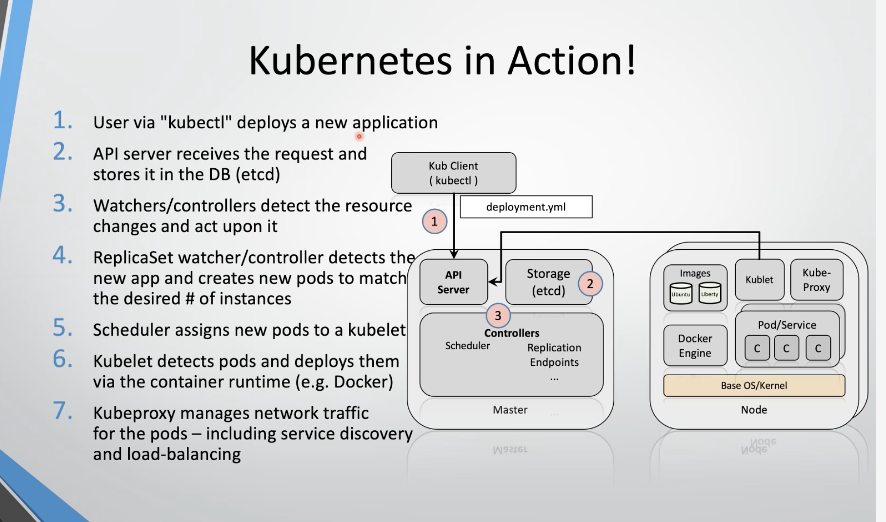

# Notas de clase - Arquitecturas Avanzadas de Software


## Taller: descomponiendo el monolito (proyecto `descomponiendo-monolito/`)

App "ambassador": los embajadores generan links de productos, los compradores pagan con Stripe y el embajador gana una comisión. Backend `node-ambassador` (Express + TypeORM + MySQL + Redis) y tres frontends: admin (3000), embajador (4000) y checkout (5000).

### Ejercicio 1 (2026-09-18): extraer el envío de correos a un microservicio con Kafka

Qué se hizo:
- Antes, `node-ambassador` mandaba los 2 correos de cada orden directo a MailHog.
- Ahora, al confirmar la orden, publica un mensaje en el topic `email_topic`. El nuevo `email-microservice` lo consume (grupo `email-consumer`) y envía los correos.
- Broker: Google Cloud Managed Service for Apache Kafka (`cluster-0`, us-east1). No es Confluent.

Por qué (arquitectura):
- Desacoplamiento temporal: la tienda no espera a que salga el correo; solo avisa.
- Tolerancia a fallos: si el servicio de correos se cae, la tienda sigue vendiendo y los mensajes esperan en Kafka.
- Es el primer paso del patrón strangler fig: sacar una capacidad del monolito sin reescribirlo.

Problemas y cómo se resolvieron:
- El cluster es privado (solo dentro de la VPC). Solución: VM bastión `kafka-bastion` con nginx `ssl_preread` que reenvía por SNI a los brokers, más un túnel SSH desde la Mac a `127.0.0.1:9092`. Los `extra_hosts` del compose apuntan los hostnames de Kafka al túnel.
- Autenticación: SASL_SSL `plain`. El usuario es el email de la service account y la clave es el key JSON en base64.
- El mensaje es un objeto explícito (`id`, `total`, `ambassador_revenue`, `ambassador_email`, `code`), porque `total` y `ambassador_revenue` son getters de la entidad y `JSON.stringify(order)` los omite.
- El backend necesitó `env_file: .env` en el compose porque `kafka.ts` se evalúa al importar, antes de `dotenv.config()`.
- Correcciones al código del profe: `depends_on` a un servicio inexistente, CORS `origin: ['*']` con `credentials: true` (el navegador lo rechaza), `@types/kafkajs` sobrante.

Evidencia: `evidencia/evidencia-kafka.png` (orden #77) y guía `evidencia/guia-kafka.pdf`.

### Ejercicio 2 (2026-09-19): carpeta `kafka/` con la configuración compartida

Qué se hizo:
- La conexión a Kafka estaba copiada en los dos servicios (código, `.env` y `extra_hosts`). Se movió a una sola carpeta:
  - `kafka/config.ts`: `kafkaConfig(clientId)` devuelve la configuración; cada servicio hace `new Kafka(kafkaConfig('...'))`.
  - `kafka/compose.yaml`: servicio base `kafka-client` (variables, volumen `/kafka`, `extra_hosts`) con `profiles: [base]` para que no arranque solo.
  - `kafka/.env` (gitignored) y `kafka/.env.example`.
- Cada `docker-compose.yaml` lo trae con `include` y lo hereda con `extends`.

Detalles técnicos:
- `config.ts` no importa nada: en el contenedor vive en `/kafka`, fuera de `/app`, donde no hay `node_modules`.
- La interpolación de `${KAFKA_HOST_SUFFIX}` no funciona con `extends` solo; hace falta `include` con su `env_file`.

Trade-off: una sola fuente de verdad y menos desalineación, a cambio de acoplar los servicios a la misma carpeta del repo. Si se despliegan por separado, conviene inyectar la configuración desde fuera (gestor de secretos).

Incidente en el smoke test: el controlador de órdenes se cambió a `topic: "default"` con `{...order}`. La tienda seguía vendiendo, pero no salían correos (`This server does not host this topic-partition`). Se volvió a `email_topic` con el objeto explícito. Lección: la prueba e2e pasa aunque no lleguen correos, así que hay que revisar MailHog.

Evidencia: `evidencia/evidencia-kafka-config.png` (orden #81, 2 correos).

### Arranque y apagado del ambiente

1. `gcloud compute instances start kafka-bastion --zone=us-east1-b` (unos 30 s).
1. Túnel en su propia terminal: `gcloud compute ssh kafka-bastion --zone=us-east1-b -- -N -L 127.0.0.1:9092:127.0.0.1:9092`. Verificar con `nc -z 127.0.0.1 9092`.
1. `docker compose up -d` en `node-ambassador` y después en `email-microservice`.
1. Frontends según el README; las apps CRA con `npx -y node@16`.
1. Al terminar: `docker compose down` en ambos y `gcloud compute instances stop kafka-bastion --zone=us-east1-b`.

### Segunda parte del taller (2026-09-19)

Producer de Kafka:
- `kafka/config.ts` solo da la conexión (clientId, brokers, SASL). El producer necesita además el **topic** al que publica (`email_topic`); publica al topic, no a un servicio.
- En `send()` también entran: mensaje (key y value), partición (la key define la partición y el orden) y `acks` (durabilidad frente a latencia).

Orquestación de contenedores:
- Kubernetes es el más popular: lo adopta la comunidad y lo usan las big tech.
- Kubernetes existe para implementar un modelo de orquestación de contenedores: se declara el estado deseado y el clúster se encarga de mantenerlo.
- Un clúster de Kubernetes es un conjunto de capacidad de hardware, física o virtualizada, con procesos como el API server. Es infraestructura que reacciona a eventos creando nueva infraestructura.
- Tipos de nodo:
  - **Master node** (control plane): API server, scheduler, controller manager y etcd. Decide dónde y qué corre.
  - **Worker node**: corre los pods (kubelet, kube-proxy, container runtime).
- Componentes del master:
  - **Scheduler**: asigna cada pod nuevo a un worker según los recursos disponibles (CPU, memoria) y las restricciones.
  - **API server**: la puerta de entrada; todo pasa por él (`kubectl` incluido).
  - **Controller manager**: el loop de reconciliación que compara el estado real con el deseado.
  - **etcd**: base clave-valor donde se guarda el estado del clúster.
- El control plane es el cerebro de Kubernetes: expone una API (API server) y guarda el estado en un almacén clave-valor (etcd).

Kubernetes 101 al nivel más alto (diapositiva 90):
- **Container cluster** = gestión del estado deseado (desired state management). Lo implementan los Kubernetes Cluster Services, que exponen una API y corren en los nodos master y etcd (VMs).
- **Node** = host de contenedores con un agente llamado **kubelet** (VM).
- **Application deployment file** = archivo de configuración (YAML) con el estado deseado.
- **Container image** = corre dentro de un **pod** (aproximadamente 1:1).
- **Replicas** = copias de un pod que deben estar corriendo.
- Ejemplo `App_X.yaml`: `ContainerImage1` con `replicas: 3` y `ContainerImage2` con `replicas: 2`. Se envía a la API y el clúster reparte los 5 pods entre los nodos; si uno muere, lo recrea para volver a 3 y 2.

Arquitectura de Kubernetes:
- En el fondo, Kubernetes es una base de datos (etcd) con **watchers** y **controllers** que reaccionan a los cambios en esa base.
- Los controllers son lo que hace que Kubernetes sea Kubernetes. Poder enchufar controllers nuevos (pluggability y extensibilidad) es parte de su "secret sauce": por ejemplo, operators y CRDs.
- La base representa el **estado deseado** del usuario; los watchers intentan que la realidad coincida con él (loop de reconciliación).
- Flujo:
  1. El cliente o usuario (`kubectl`) hace un request al **API server**, que es el front-end HTTP/REST de la base.
  1. El API server escribe el estado deseado en etcd.
  1. El watcher-controller monitorea el API server (no la base directamente) y actúa sobre los recursos: networks, volumes, secrets, etc., y los nodos.
- Implicación de arquitectura: es un modelo declarativo y event-driven (se reacciona a cambios de estado, no a órdenes imperativas). Se parece a lo que hicimos con Kafka: un productor publica un cambio y los consumidores reaccionan.

TL;DR de la arquitectura: Kubernetes es una base de datos (etcd) que guarda cómo quieres que esté todo, más controllers que trabajan para que la realidad se parezca a eso.
1. Declaras lo que quieres (por ejemplo, 3 réplicas) y se lo mandas al API server, que es la puerta REST de etcd.
1. El API server lo guarda en etcd. Todavía no ha pasado nada en los nodos.
1. Los controllers vigilan el API server: ven 3 réplicas pedidas y 0 corriendo, y crean pods, redes, volúmenes y secrets en los nodos.
1. Si muere un pod, la realidad (2) ya no coincide con lo declarado (3) y el controller lo recrea.

No se le dan órdenes al clúster: se describe el estado deseado y los controllers lo persiguen sin parar. De ahí vienen la autorreparación y la extensibilidad (basta con agregar controllers).

Modelo de recursos de Kubernetes:
- Hay un recurso para cada propósito: ConfigMaps, DaemonSets, **Deployments**, Events, Endpoints, Ingress, Jobs, Nodes, Namespaces, **Pods**, PersistentVolumes, ReplicaSets, Secrets, ServiceAccounts, **Services**, StatefulSets y más.
- Kubernetes busca dar los bloques de construcción de una plataforma cloud native. Por eso el modelo de recursos interno es el mismo que ve el usuario final: todo es un recurso de la API, tanto para los controllers como para `kubectl`.
- Recursos clave:
  - **Pod**: conjunto de contenedores que corren juntos (comparten red y volúmenes). Es la unidad mínima de despliegue. Otros recursos lo gestionan: ReplicaSets, Deployments, StatefulSets.
  - **Service**: define cómo se expone la app como una entrada DNS. Usa un selector por etiquetas (query) para elegir a qué pods aplica. Da una dirección estable aunque los pods cambien de IP.
- En qué se diferencian los recursos que gestionan pods:
  - **ReplicaSet**: mantiene N copias.
  - **Deployment**: gestiona ReplicaSets y agrega rolling update y rollback. Es el que se usa normalmente para servicios stateless.
  - **StatefulSet**: pods con identidad y almacenamiento estables (bases de datos, Kafka).
  - **DaemonSet**: un pod por nodo (agentes de logs y monitoreo).
  - **Job**: tarea que corre hasta terminar.
- Aplicado al taller: `node-ambassador` y `email-microservice` serían Deployments con su Service; `kafka/.env` pasaría a Secret y la configuración no sensible a ConfigMap.

Services (exposición):
- Un Service es la forma de exponer los puertos de los pods y define cómo presenta el clúster la app hacia fuera, incluso para un browser.
- Tipos:
  - **ClusterIP** (por defecto): solo accesible dentro del clúster, por ejemplo de servicio a servicio.
  - **NodePort**: abre un puerto (30000-32767) en cada nodo; se llega con `IP-del-nodo:puerto`.
  - **LoadBalancer**: el proveedor cloud crea un balanceador con IP pública. Es el camino típico para llegar desde un browser.
  - **Ingress** (es un recurso aparte, no un tipo de Service): enruta HTTP por host y path hacia varios Services detrás de una sola IP, y termina TLS.
- Equivalente en Compose: `ports: "8000:8000"` sería un NodePort o LoadBalancer; la red interna entre servicios sería ClusterIP.

StatefulSets (persistencia):
- Son para cargas con estado (bases de datos, Kafka, colas).
- Cada pod tiene una identidad estable (`mysql-0`, `mysql-1`), arranca y se detiene en orden, y tiene su propio volumen (PersistentVolumeClaim) que sobrevive si el pod se recrea.
- Contraste con Deployment: sus pods son intercambiables y no tienen estado. Si uno muere, llega otro con otro nombre y sin disco propio.
- Trade-off: se puede operar estado dentro de Kubernetes, pero es más difícil (backups, upgrades, failover). Muchas veces conviene un servicio administrado (Cloud SQL, Confluent) y dejar en el clúster solo lo stateless, que es lo que hicimos con Kafka.

Cliente de Kubernetes (`kubectl`):
- Es la herramienta CLI para interactuar con el clúster; por debajo le habla al API server.
- Es un binario específico por plataforma: https://kubernetes.io/docs/tasks/tools/install-kubectl (en Mac: `brew install kubectl`).
- El usuario manipula los recursos directamente con archivos JSON o YAML: `kubectl (create|get|apply|delete) -f myResource.yaml`.
- `create` es imperativo y falla si el recurso ya existe. `apply` es declarativo: crea o actualiza según el archivo, y es el que encaja con el modelo de estado deseado (y con GitOps).

Kubernetes en acción (flujo de un despliegue):
1. El usuario despliega una app nueva con `kubectl` (`deployment.yml`).
1. El API server recibe el request y lo guarda en etcd.
1. Los watchers o controllers detectan el cambio en los recursos y actúan.
1. El controller de ReplicaSet ve la app nueva y crea pods hasta llegar al número de instancias deseado.
1. El scheduler asigna los pods nuevos a un kubelet, es decir, a un nodo.
1. El kubelet detecta los pods que le asignaron y los despliega con el container runtime (por ejemplo, Docker o containerd). Si la imagen no está en el nodo, la descarga del registry.
1. Kube-proxy gestiona el tráfico de red de los pods: service discovery y balanceo de carga.
- Componentes del diagrama:
  - Master: API server, storage (etcd) y controllers (scheduler, replication, endpoints, ...).
  - Node: images, kubelet, kube-proxy, container runtime (Docker Engine), pods o services con sus contenedores (C), sobre el SO base y el kernel.
- Nadie llama directamente al siguiente paso: cada componente observa el API server y reacciona. Es una coreografía, no una orquestación central.



TL;DR del flujo, de `kubectl apply -f deployment.yml` a contenedores corriendo:
1. Con `kubectl` mandas el YAML: "quiero 3 pods de mi app".
1. El API server lo guarda en etcd. Por ahora solo está escrito.
1. El controller de réplicas ve 3 pedidos y 0 corriendo, y crea 3 pods pendientes (sin nodo).
1. El scheduler ve los pods sin nodo y asigna cada uno a un nodo según los recursos libres.
1. El kubelet de cada nodo ve su pod asignado, descarga la imagen y arranca el contenedor (Docker o containerd).
1. Kube-proxy configura la red para que el Service reparta el tráfico entre los 3 pods.

El master decide y los nodos ejecutan. Nadie da órdenes directas: todos observan el API server y reaccionan a los cambios.


## Clase 2026-09-25

Lab 3 (guestbook con Redis):
- `kubectl get pods` muestra, además de los pods del guestbook, pods de Redis como `redis-master-<hash>-<id>` y `redis-slave-<hash>-<id>`. Salen de los Deployments `redis-master-deployment.yaml` y `redis-slave-deployment.yaml`.
- Redis es la base de datos del guestbook: el frontend no guarda nada y los mensajes quedan en Redis. El master recibe las escrituras y los slaves son réplicas de lectura.
- El nombre del pod es el del Deployment, más el hash del ReplicaSet, más un sufijo aleatorio.

Objetivo del ejercicio (según el profe): crear una aplicación con estos conceptos, en tres pasos incrementales:
1. **Agregar recursos**: entender cómo se suman recursos de Kubernetes (Deployment, Service, etc.) a una app ya desplegada, uno por uno con `kubectl create/apply -f`.
1. **De stateless a persistente**: empezar con una app sin persistencia (guestbook solo; si el pod muere, se pierden los mensajes) y agregarle una capa de datos (Redis master + su Service).
1. **Alta disponibilidad de la persistencia**: modelar HA sobre esa capa de datos con réplicas de lectura (Redis slaves + su Service). El master recibe las escrituras y los slaves reparten las lecturas.

Trade-offs a tener presentes:
- La replicación master/slave de este lab da HA para lecturas, no para escrituras: si cae el master, nadie escribe hasta que Kubernetes lo recrea. El failover automático requiere Redis Sentinel o Redis Cluster.
- Los Redis del lab son Deployments sin volumen: si el pod del master se recrea, los datos se pierden. Persistencia real pide StatefulSet + PersistentVolumeClaim (o un servicio administrado).
- La replicación de Redis es asíncrona: un slave puede devolver datos un poco atrasados (consistencia eventual).

Idea clave: Kubernetes permite gestionar la **aplicación**, no la infraestructura. **Los recursos van en función de la app.** Uno no administra servidores, IPs ni discos: declara los recursos que la app necesita para funcionar (Deployments, Services, réplicas, volúmenes) y el clúster se encarga de la infra por debajo.
- Ejemplo del lab: para darle persistencia al guestbook no se instala Redis en un servidor; se agregan un Deployment y un Service de Redis. Para darle HA, se agregan los slaves. Todo son recursos en función de lo que pide la app.
- Por eso es una plataforma cloud native: la app se describe en términos de su propia arquitectura y la infraestructura queda abstraída.

Worker pool:
- Grupo de worker nodes con la misma configuración (tipo de máquina, CPU, memoria, zona). Es el término de IBM Cloud; en GKE se llama *node pool* y en EKS *node group*.
- El clúster puede tener varios pools con perfiles distintos, por ejemplo uno de propósito general y otro con GPU o más memoria. Con labels, taints y `nodeSelector` se decide qué pods van a cada pool.
- Se escala el pool entero (más o menos nodos), no nodo por nodo. Con el cluster autoscaler, el pool crece si hay pods `Pending` por falta de recursos.
- Repartir un pool en varias zonas da alta disponibilidad de infraestructura: si cae una zona, los pods se reprograman en los nodos de las otras.
- En el lab local no aplica: Docker Desktop tiene un solo nodo, que hace de master y de worker.

- Un solo clúster puede alojar varias aplicaciones, cada una en el pool que le sirve según su trabajo (web en máquinas generales, ML en GPU, caché en máquinas con mucha memoria). Se separan con `nodeSelector` o afinidad para el pool, taints y tolerations para reservarlo, y namespaces con cuotas para aislar cada app. Trade-off frente a varios clústeres: menos costo y operación, pero comparten control plane y el aislamiento es menor (fallas, seguridad, upgrades).

- Ejemplos de aplicaciones contenerizadas que guardan datos (stateful): bases de datos (PostgreSQL, MySQL, MongoDB), cachés y almacenes clave-valor (Redis, etcd), brokers de mensajes (Kafka, RabbitMQ), motores de búsqueda (Elasticsearch), almacenamiento de objetos (MinIO), monitoreo (Prometheus guarda sus métricas) y apps con archivos subidos (WordPress, Nextcloud). En Kubernetes van con StatefulSet + PersistentVolumeClaim, o se delegan a un servicio administrado.

Patrones multi-contenedor en un pod (Brendan Burns, *Designing Distributed Systems*):
- **Sidecar**: agrega una capacidad sin tocar la app (logs, proxy de service mesh, recarga de configuración).
- **Adapter**: traduce la interfaz de la app a lo que el resto espera. Ejemplo: una app vieja que solo habla SOAP/XML; un contenedor adapter en el mismo pod expone REST/JSON y por `localhost` traduce a SOAP. Los clientes nuevos no saben que por detrás hay SOAP.
- **Ambassador**: el inverso. Un proxy local por el que la app sale hacia fuera (por ejemplo, la app habla con `localhost:6379` y el ambassador enruta a un Redis shardeado).
- Relación con DDD: el adapter es una **capa anticorrupción** (anti-corruption layer): aísla el modelo nuevo del modelo legacy. Encaja con el strangler fig: se envuelve lo viejo, se consume con la interfaz nueva y se va reemplazando por partes.
- Trade-off: el adapter en el mismo pod escala y se despliega junto a la app (se comunican por `localhost`, baja latencia). Si varias apps necesitan la misma traducción, conviene un servicio aparte o un API gateway, no un adapter por pod.

Qué comparten los contenedores de un pod (namespaces de Linux del pod):
- **Red**: una sola IP y un rango de puertos; entre ellos se hablan por `localhost` (dos contenedores no pueden usar el mismo puerto).
- **Hostname** (UTS namespace): todos ven el nombre del pod.
- **IPC**: memoria compartida y colas de mensajes System V/POSIX entre procesos de distintos contenedores.
- **Volúmenes**: los declarados en el pod, montados donde cada contenedor diga.
- **CPU y memoria**: se declaran por contenedor (`requests`/`limits`); el pod consume la suma, y el scheduler lo ubica con esa suma.
- No comparten, por defecto, el sistema de archivos ni el espacio de procesos (se activa con `shareProcessNamespace: true`).

Comunicación entre pods:
- Entre pods distintos se hablan por la **red**, con un protocolo de aplicación sobre TCP/UDP (HTTP/REST, gRPC, el protocolo de Redis, Kafka, SOAP…). Kubernetes no impone cuál: lo elige la app.
- Modelo de red de Kubernetes: todos los pods se ven por IP sin NAT, en cualquier nodo. Lo implementa el plugin **CNI** (Calico, Flannel, Cilium).
- En la práctica no se usa la IP del pod (cambia al recrearse), sino el **Service** por DNS: el guestbook llama a `redis-master:6379`.
- Dentro del mismo pod no hace falta red: `localhost`, IPC o un volumen compartido.
- Para restringir quién habla con quién: NetworkPolicy. Para mTLS, reintentos y trazas: service mesh (Istio, Linkerd) con sidecars.

Quién hace qué (aclaración):
- El **scheduler** solo decide **dónde**: ve pods sin nodo y le asigna uno a cada uno (filtra los nodos que caben por `requests`, taints y afinidad, y puntúa los que quedan). No arranca pods ni vigila que funcionen.
- Los **controllers** (controller manager) validan que el estado real coincida con el declarado (loop de reconciliación): si faltan réplicas, crean pods.
- El **kubelet** de cada worker arranca los contenedores y valida que funcionen, con las probes (liveness reinicia, readiness saca del Service). Reporta el estado al API server.

Agendamiento (scheduling) de pods:
1. **Filtrado**: descarta los nodos donde el pod no cabe o no puede ir (recursos libres menores que `requests`, `nodeSelector`, afinidad, taints sin toleration, puertos ocupados).
1. **Puntuación**: ordena los nodos que quedan (balance de carga, imagen ya descargada, preferencias de afinidad y de reparto por zonas).
1. **Binding**: escribe en el API server el nodo elegido (`spec.nodeName`). El kubelet de ese nodo lo ve y arranca el pod.
- Si ningún nodo pasa el filtro, el pod queda en `Pending` (`kubectl describe pod` muestra el motivo, por ejemplo `Insufficient cpu`). Ahí entra el cluster autoscaler.
- Herramientas para influirlo: `nodeSelector`, node affinity, pod affinity/anti-affinity (por ejemplo, réplicas de Redis en nodos distintos para HA), taints y tolerations, `topologySpreadConstraints` y PriorityClass (un pod más prioritario puede desalojar a otros: preemption).

Si muere la VM de un worker:
1. El kubelet deja de reportar; el node controller marca el nodo `NotReady` (unos 40 s sin heartbeat) y le pone un taint.
1. Tras la tolerancia por defecto (`tolerationSeconds: 300`, unos 5 min) los pods de ese nodo se marcan para desalojo.
1. El controller de su ReplicaSet ve que faltan réplicas y crea pods **nuevos** (otro nombre, otra IP). El scheduler los asigna a nodos sanos.
- Los pods no se "mueven": se reemplazan. Por eso el estado no puede vivir dentro del pod.
- Un pod suelto (sin Deployment) no vuelve.
- Los pods de un StatefulSet esperan hasta confirmar que el nodo murió (para no tener dos `redis-0` escribiendo el mismo disco). Si su volumen está atado a una zona, solo pueden volver en esa zona.
- Si no hay capacidad libre, quedan `Pending` hasta que el cluster autoscaler agregue un nodo.

- El profe: Kubernetes **rebalancea la app según la disponibilidad de recursos**. Matiz: el scheduler reparte cada pod **nuevo** según los recursos libres, pero no mueve los pods que ya corren. Si se agrega un nodo, queda vacío hasta que se creen pods nuevos (escalado, rollout, fallas). Para rebalancear lo que ya corre existe el **Descheduler** (proyecto aparte), que desaloja pods de nodos cargados para que el scheduler los vuelva a ubicar.

ConfigMaps y Secrets:
- Sacan la configuración de la imagen: la misma imagen corre en dev y prod con distinta configuración (factor III de 12-factor).
- **ConfigMap**: configuración no sensible (URLs, flags, archivos de configuración).
- **Secret**: datos sensibles (claves, tokens, certificados). Ojo: por defecto va en **base64, no cifrado**; hay que activar cifrado en reposo de etcd, restringir con RBAC o usar un gestor externo (Vault, Secret Manager).
- El pod los consume como variables de entorno o montados como archivos en un volumen. Montados, se actualizan solos; como variables, requieren reiniciar el pod.
- Aplicado al taller: `kafka/.env` (usuario y clave SASL) pasaría a Secret; `KAFKA_HOST_SUFFIX` y el topic, a ConfigMap.

- Propósito (según el profe): separar la configuración de los pods para hacer **imágenes reutilizables**. Se construye una sola imagen y se promueve igual por dev, pruebas y prod; solo cambian el ConfigMap y el Secret de cada ambiente. Así lo probado es exactamente lo que se despliega (build once, deploy many).

- Todas las réplicas de un Deployment apuntan a **un solo ConfigMap**: la referencia está en la plantilla del pod, así que las N réplicas leen la misma configuración (una sola fuente de verdad). Consecuencia: si se cambia el ConfigMap y se consume como variables, las réplicas no lo ven hasta reiniciarse (`kubectl rollout restart deployment <nombre>`); montado como volumen, se actualiza solo en todas (con retraso de hasta un minuto).

Labels:
- Pares llave-valor que se pegan a cualquier recurso para **agrupar** (por ejemplo `app: guestbook`, `role: master`, `env: prod`).
- Con **selectores** se eligen grupos: el Service manda tráfico a los pods con `app: guestbook`; el Deployment gestiona los pods que cumplen su `selector`; `kubectl get pods -l app=redis,role=master` filtra en consola.
- Son la forma de acoplamiento flojo en Kubernetes: el Service no conoce los pods por nombre, solo por labels. Un pod nuevo con el label correcto entra solo al balanceo.
- Diferencia con annotations: los labels sirven para seleccionar; las annotations guardan metadatos que no se usan para filtrar (autor, versión del build, configuración de herramientas).

- En palabras del profe: el **label** es parecido a un **tag** (etiqueta para agrupar y buscar); las **annotations** sirven para configurar librerías o herramientas que leen el recurso. Ejemplos: `nginx.ingress.kubernetes.io/rewrite-target: /` configura el Ingress de NGINX; `prometheus.io/scrape: "true"` le dice a Prometheus que recoja métricas del pod; `kubectl.kubernetes.io/last-applied-configuration` la escribe `kubectl apply` para calcular diferencias.

Retos de comunicación entre pods:
- Los pods cambian de IP al recrearse, así que no se les habla directo: se pone un **Service** delante, con IP y DNS estables.
- **ClusterIP** (tipo por defecto): IP virtual que **solo responde dentro del mismo clúster**. Es para comunicación interna entre servicios. En el lab, `redis-master` y `redis-slave` son ClusterIP: el guestbook los alcanza, el browser no.
- Para llegar desde fuera hace falta NodePort, LoadBalancer o Ingress (como el Service `guestbook`).
- Buena práctica de seguridad: todo lo interno (bases de datos, cachés) en ClusterIP y solo el frontend expuesto.

Service tipo LoadBalancer:
- Distribuye el **tráfico** entre los pods (no los pods entre nodos, eso es del scheduler).
- En la nube, el cloud controller manager crea un balanceador del proveedor con IP pública (GCP, AWS, Azure) y lo enlaza al clúster.
- On-premise se puede enlazar un **balanceador físico** o externo: F5 BIG-IP (con su controller para Kubernetes), Citrix, o **MetalLB** en bare metal, que anuncia las IPs por ARP o BGP. En Docker Desktop, el LoadBalancer queda en `localhost`.
- Trade-off: un LoadBalancer por Service sale caro (una IP y un balanceador por app); con muchas apps HTTP conviene un solo LoadBalancer delante de un Ingress que enrute por host y path.

Service discovery:
- Kubernetes ofrece **descubrimiento de servicios** que funciona como un **DNS** interno (CoreDNS, corre como pods en `kube-system`).
- Cada Service recibe un nombre: `<servicio>.<namespace>.svc.cluster.local`. Dentro del mismo namespace basta el nombre corto: el guestbook se conecta a `redis-master:6379`.
- El DNS devuelve la ClusterIP del Service y kube-proxy reparte entre los pods detrás. El cliente no sabe cuántos pods hay ni sus IPs.
- Con un headless Service (`clusterIP: None`) el DNS devuelve las IPs de cada pod; lo usan los StatefulSets (`redis-0.redis`).
- Frente al taller: en Compose, el DNS de Docker cumple el mismo papel (`redis` o `kafka` por nombre de servicio).

- El profe: el service discovery busca **matricular (registrar) todos los servicios** para que uno pueda preguntar por el nombre de un servicio en particular y obtener dónde está. Es el patrón **service registry**.
- En Kubernetes el registro es automático (**third-party registration**): al crear un Service, la plataforma lo inscribe en el DNS, y el controller de Endpoints actualiza qué pods sanos están detrás. La app no se registra sola.
- Contraste: en sistemas sin Kubernetes, la app se registra a sí misma (**self-registration**) en un registry como Eureka o Consul, y debe darse de baja al morir.

Definición de Service (según el profe): abstracción que define un **conjunto lógico de pods**, elegidos con un **label selector**, y una política para acceder a ellos. Provee una funcionalidad, como un **microservicio**: el cliente consume "redis-master" o "guestbook", no pods concretos. Los pods detrás pueden morir, escalar o cambiar de versión y el Service sigue igual (nombre DNS e IP estables).

- Administrar múltiples pods lo hace Kubernetes: **abstrae las necesidades** (réplicas, reinicios, reparto en nodos, red, descubrimiento, balanceo). Uno declara qué necesita la app; Kubernetes resuelve cómo.

Loop de reconciliación (formulación del profe): **observa, analiza el estado, actúa**, y vuelve a empezar.
1. Observa: watch sobre el API server (estado real).
1. Analiza: compara el estado real con el deseado (etcd).
1. Actúa: crea, borra o actualiza recursos para cerrar la diferencia.

ReplicaSet:
- Se asegura de que haya un **número idéntico de pods** (réplicas) ejecutándose al mismo tiempo. Si faltan, crea; si sobran, borra.
- Los pods que gestiona se eligen con **labels** (su `selector`), no por nombre.
- Puede **adoptar pods existentes**: si hay pods sueltos con los labels de su selector y sin dueño (`ownerReferences` vacío), los toma como propios y los cuenta en las réplicas. Con un Deployment no pasa: su ReplicaSet agrega el label `pod-template-hash` al selector (en el lab: `app=guestbook, pod-template-hash=5fd476b4c4`), así que un pod a mano con solo `app: guestbook` no se adopta. Sí pasa con un ReplicaSet creado directo.
- En la práctica no se crea directo: lo crea el Deployment, que agrega rolling update y rollback (un ReplicaSet por versión).

Ejemplo de adopción (probado en el clúster local):
```yaml
# rs-demo.yaml
apiVersion: apps/v1
kind: ReplicaSet
metadata:
  name: demo-rs
spec:
  replicas: 3
  selector:
    matchLabels:
      app: demo
  template:
    metadata:
      labels:
        app: demo
    spec:
      containers:
      - name: web
        image: nginx:alpine
```
1. Crear un pod suelto con el mismo label: `kubectl run suelto --image=nginx:alpine --labels=app=demo`.
1. Aplicar el ReplicaSet: `kubectl apply -f rs-demo.yaml`.
1. Resultado: el ReplicaSet crea solo **2** pods nuevos y adopta a `suelto` como tercero (su `ownerReferences` pasa a ser `demo-rs`).
1. Borrar `suelto`: el ReplicaSet ve 2 de 3 y crea un pod nuevo `demo-rs-xxxxx` para volver a 3.
1. Limpiar: `kubectl delete rs demo-rs` (borra también los pods que gestiona).

- El ReplicaSet permite **entornos homogéneos**: todas las réplicas salen de la misma plantilla (misma imagen, configuración y recursos), son intercambiables y da igual cuál atiende. Si la app **necesita estado**, se usa un **StatefulSet**: réplicas con identidad y disco propios, que ya no son intercambiables.

DaemonSet:
- El profe: parecido a un pod, pero se ejecuta **en background sobre los worker nodes**. Precisión: el DaemonSet no es un pod, es el recurso que garantiza **un pod por nodo** (o por cada nodo que cumpla un selector).
- Si se agrega un nodo, le crea su pod automáticamente; si se quita el nodo, el pod se va con él. No se define número de réplicas: lo da el número de nodos.
- Usos: agentes que deben estar en cada máquina, como recolectores de logs (Fluent Bit), métricas (node-exporter), red (el plugin CNI, kube-proxy) o almacenamiento.
- Nombre heredado de los *daemons* de Unix: procesos de fondo del sistema, no de la app.

- Un DaemonSet puede ser una app "en modo escucha" en cada nodo (agente que observa y reporta).
- Precisión: el **kubelet no es un DaemonSet**. Corre como proceso del sistema operativo del nodo (servicio systemd), fuera de Kubernetes, porque es quien arranca los pods: si fuera un pod, nadie podría arrancarlo. Lo que sí corre como DaemonSet es **kube-proxy** (y el CNI, `kindnet` en Docker Desktop).

Jobs y CronJobs:
- **Job**: ejecuta una tarea **hasta que termine** (a diferencia de un Deployment, que mantiene pods vivos para siempre). Si el pod falla, lo reintenta (`backoffLimit`). Puede correr varias en paralelo (`parallelism`, `completions`). Ejemplos: migración de base de datos, procesar un lote, generar un reporte.
- **CronJob**: el que **agenda**: crea un Job según un horario en formato cron (`schedule: "0 2 * * *"` = todos los días a las 2 a. m.). Ejemplos: backups de Redis, limpieza de datos, envío de correos masivos.
- Precisión: agendar en el tiempo es del CronJob; el Job solo ejecuta una vez hasta completar.

- Los Jobs se usan para **levantar pods por demanda** y evitar gasto de recursos: el pod existe solo mientras corre la tarea y libera CPU y memoria al terminar (`ttlSecondsAfterFinished` borra el Job terminado). Frente a un Deployment con un pod ocioso esperando trabajo, se paga solo el tiempo de ejecución. Para escalar por demanda según eventos (por ejemplo, mensajes en un topic de Kafka), existe **KEDA**, que crea Jobs o escala Deployments incluso desde cero.

Patrones de Jobs (documentación de Kubernetes):
1. **No paralelo**: un pod, una tarea (`completions: 1`). Ejemplo: migración de base de datos.
1. **Conteo fijo de completions**: N ejecuciones exitosas, con `parallelism` pods a la vez. Con `completionMode: Indexed` cada pod recibe su índice (`JOB_COMPLETION_INDEX`) y procesa su parte (por ejemplo, el archivo 0, 1, 2…).
1. **Cola de trabajo** (work queue): varios pods en paralelo toman ítems de una cola (Redis, RabbitMQ, Kafka) hasta vaciarla; se fija `parallelism` y no `completions`.
1. **Un Job por ítem** (template expansion): se genera un Job por cada elemento desde una plantilla. Simple, pero muchos Jobs cargan el API server.
1. **Programado**: CronJob, crea Jobs según el horario.
- Trade-off: el work queue escala mejor y reparte carga dinámica, pero exige una cola externa; el indexado no la necesita, pero el reparto es fijo.

Los tres patrones de Jobs según el profe:
- **One shot**: un pod ejecuta la tarea una vez hasta completarla (`completions: 1`, `parallelism: 1`).
- **Paralelismo**: varios pods corren a la vez hasta sumar un número fijo de completions (`completions: N`, `parallelism: M`).
- **Worker queue**: varios pods workers toman trabajo de una cola hasta vaciarla (`parallelism: M`, sin `completions`); el Job termina cuando un worker sale con éxito y los demás acaban.

Versionamiento de aplicaciones:
- La versión vive en el **tag de la imagen** (`ibmcom/guestbook:v1` → `:v2`). Evitar `latest`: no dice qué versión corre ni permite volver atrás con certeza.
- El **Deployment** guarda el historial: cada cambio de plantilla crea un ReplicaSet nuevo (una revisión) y conserva los anteriores (`revisionHistoryLimit`, 10 por defecto).
- Comandos (Lab 2): `kubectl set image deployment/guestbook guestbook=ibmcom/guestbook:v2`, `kubectl rollout status`, `kubectl rollout history`, `kubectl rollout undo` (vuelve a la revisión anterior en segundos: reactiva el ReplicaSet viejo).
- Estrategias:
  - **RollingUpdate** (por defecto): reemplaza pods de a poco (`maxSurge`, `maxUnavailable`); sin caída, pero conviven v1 y v2 un rato (la API debe ser compatible entre versiones).
  - **Recreate**: mata todos y levanta la versión nueva; hay caída, pero nunca conviven dos versiones.
  - **Blue/green**: dos Deployments completos y se cambia el selector del Service de golpe. Rollback instantáneo, doble de recursos.
  - **Canary**: una fracción del tráfico va a la v2 (réplicas proporcionales, o un service mesh o Ingress con pesos). Se valida con usuarios reales antes de pasar todo.

- Las versiones de las imágenes se guardan en un **registry** (Docker Hub, Artifact Registry de GCP, ECR, Harbor on-premise), que puede ser privado o local. Cada nodo además tiene una **caché local** de imágenes: si ya tiene la versión, no la vuelve a descargar (`imagePullPolicy: IfNotPresent`); con `Always` consulta el registry siempre. El rollback es rápido porque la imagen vieja suele seguir en la caché del nodo.
- Un registry local (por ejemplo `registry:2` en `localhost:5000`) sirve para desarrollo o para clústeres sin salida a internet.

- El registry puede ser **público** (Docker Hub, cualquiera descarga) o **privado** (requiere credenciales). Para un privado, Kubernetes usa un Secret de tipo `docker-registry` referenciado en el pod con `imagePullSecrets`:
  `kubectl create secret docker-registry regcred --docker-server=<registry> --docker-username=<usuario> --docker-password=<clave>`
- Trade-off: Docker Hub es cómodo, pero tiene límites de descargas y expone las imágenes; un privado da control de acceso, escaneo de vulnerabilidades y cercanía al clúster (menos latencia y costo de red).

Harbor:
- Registry de contenedores **open source y privado**, proyecto graduado de la CNCF (creado por VMware). Se instala on-premise o en el propio clúster (Helm chart).
- Qué agrega frente a un registry simple: interfaz web, proyectos con control de acceso (RBAC, LDAP u OIDC), **escaneo de vulnerabilidades** de las imágenes (Trivy), firma de imágenes (Cosign/Notation), replicación entre registries (por ejemplo, espejo de Docker Hub), cuotas y políticas de retención de versiones. También guarda charts de Helm (artefactos OCI).
- Cuándo usarlo: organizaciones que no pueden depender de un registry público o de nube (bancos, gobierno) o que exigen que solo se desplieguen imágenes escaneadas y firmadas.

Deployment:
- Gestiona las réplicas a través del **pod spec** (`spec.template`): la plantilla con la que se crean todos los pods (imagen, puertos, recursos, labels, variables). `spec.replicas` dice cuántas.
- Cambiar el pod spec (por ejemplo, la imagen) dispara un rollout: nuevo ReplicaSet con la plantilla nueva y el viejo baja a 0. Cambiar solo `replicas` no crea revisión, solo escala.
- Jerarquía: Deployment → ReplicaSet (uno por versión del pod spec) → Pods.

- El Deployment permite **rollback a versiones anteriores**: `kubectl rollout undo deployment/<nombre>` vuelve a la revisión previa; `--to-revision=N` a una específica (ver números con `kubectl rollout history`). Es rápido porque el ReplicaSet viejo sigue existiendo (en 0 réplicas) y solo se vuelve a escalar. Límite: el rollback es de la plantilla del pod, no de los datos; si la v2 migró el esquema de la base, volver a la v1 no lo deshace.

Rolling update (cómo funciona):
- Reemplaza pods de a poco: sube el ReplicaSet nuevo y baja el viejo por tandas, sin caída del servicio.
- Dos parámetros (por defecto 25 % cada uno):
  - `maxSurge`: cuántos pods **extra** puede haber sobre `replicas` durante el cambio (se redondea hacia arriba).
  - `maxUnavailable`: cuántos pueden faltar por debajo de `replicas` (se redondea hacia abajo).
- Ejemplo con el guestbook (5 réplicas): `maxSurge` = 2, `maxUnavailable` = 1, así que nunca hay más de 7 pods ni menos de 4 disponibles.
  1. Crea 2 pods v2 (hay 5 v1 + 2 v2) y baja 1 v1.
  1. Cuando los v2 pasan la **readiness probe**, el Service les manda tráfico y se baja otra tanda de v1.
  1. Repite hasta 5 v2 y 0 v1. El ReplicaSet viejo queda en 0, listo para rollback.
- Si los v2 nunca quedan listos, el rollout se detiene (no sigue matando v1): sin readiness probe, Kubernetes no sabe si la v2 funciona y puede pasar tráfico a pods rotos.
- `maxSurge: 0, maxUnavailable: 1` sirve si no hay recursos para pods extra; `maxSurge: 100%` se parece a blue/green.

- El profe: el rolling update **garantiza que la ejecución en curso termine** antes de reemplazar el pod, para que haya consistencia en las transacciones ejecutadas. Cómo lo hace (**graceful shutdown**):
  1. El pod viejo se saca de los Endpoints del Service: deja de recibir tráfico nuevo.
  1. Se ejecuta el `preStop` hook, si hay, y se envía **SIGTERM** al contenedor.
  1. La app termina lo que tiene en curso (peticiones, transacciones, mensajes de Kafka) y cierra conexiones.
  1. Si no terminó en `terminationGracePeriodSeconds` (30 s por defecto), recibe **SIGKILL**.
- Matiz: Kubernetes da la ventana, pero la garantía depende de la app: debe manejar SIGTERM. Si lo ignora o la tarea dura más que el plazo, se corta a la mitad. Para transacciones largas: subir el plazo, hacerlas idempotentes o usar Jobs.

Horizontal Pod Autoscaler (HPA):
- Feature incluida en Kubernetes: **crea o elimina réplicas** automáticamente según un parámetro (CPU, memoria o métricas propias como peticiones por segundo o mensajes en cola).
- Es otro loop de reconciliación: cada 15 s compara la métrica con el objetivo y ajusta `replicas` del Deployment. Fórmula: `réplicas deseadas = ceil(réplicas actuales × métrica actual / objetivo)`.
- En el lab: `guestbook-hpa` apunta a `guestbook-v1`, con `minReplicas: 3`, `maxReplicas: 5` y objetivo de CPU al 50 % de los `requests` (100m).
- Requisitos: **metrics-server** instalado y `requests` declarados. En Docker Desktop no viene metrics-server, por eso `kubectl get hpa` muestra `cpu: <unknown>/50%` y no escala.
- Horizontal = más pods; vertical (VPA) = más CPU y memoria al mismo pod; cluster autoscaler = más nodos. El HPA solo sirve si la app es stateless.
- Para bajar, espera 5 min por defecto (ventana de estabilización) para no oscilar.

- El HPA funciona sobre cualquier recurso con subrecurso `scale`: **Deployments, ReplicaSets y StatefulSets** (no DaemonSets, cuyo número lo dan los nodos). Lo normal es apuntarlo al Deployment y no a su ReplicaSet: en cada rollout nace un ReplicaSet nuevo y el HPA quedaría apuntando al viejo.

- StatefulSet (según el profe): el **elemento que permite mantener el estado** en Kubernetes. Lo logra con tres piezas: identidad estable (`redis-0`), un PersistentVolumeClaim por pod que sobrevive a su muerte (`volumeClaimTemplates`) y un headless Service que da un DNS por pod. El estado no vive en el pod, sino en el volumen que el pod vuelve a montar al recrearse.

### TL;DR de la clase 2026-09-25 (el profe: "es denso, son muchos temas")

Idea central: Kubernetes gestiona la **app**, no la infra; **los recursos van en función de la app**, y cada controller corre un loop de reconciliación (observa, analiza, actúa).

| Necesidad de la app | Recurso |
|---|---|
| Correr réplicas iguales, sin estado | Deployment (→ ReplicaSet → Pods) |
| Guardar estado | StatefulSet + PersistentVolumeClaim |
| Un agente en cada nodo | DaemonSet |
| Tarea que termina / agendada | Job / CronJob |
| Nombre estable y balanceo | Service (ClusterIP interno, LoadBalancer externo) + DNS |
| Configuración y claves fuera de la imagen | ConfigMap / Secret |
| Agrupar y seleccionar | Labels (annotations = config para herramientas) |
| Escalar según carga | HPA |
| Cambiar de versión sin caída | Rolling update + rollback |
| Guardar imágenes versionadas | Registry (Docker Hub, Harbor) |

Lab 3: guestbook stateless → + Redis master (persistencia) → + Redis slaves (HA de lecturas).

### Intención del curso (según el profe)

Aprender a construir aplicaciones de este estilo **sin morir en el intento**, cuidando tres decisiones:
1. **Granularidad**: determinar el tamaño de cada app o servicio que se despliega en un modelo de microservicios (qué se separa y qué se deja junto). Muy fino da sobrecarga de red y operación; muy grueso, un monolito distribuido.
1. **Tecnologías homologadas y dependencias**: un conjunto estándar de tecnologías con las que las apps funcionan, y todas las dependencias que cada una necesita (base de datos, cola, caché, configuración, secretos) declaradas como recursos.
1. **Modelo de entrega de cómputo adecuado** (contenedores y Kubernetes, serverless, máquinas virtuales) para que la app se comporte como se quiere: **escalabilidad, elasticidad, recursos razonables y resiliencia**.

Conexión con lo visto: el taller del monolito es la granularidad (extraer `email-microservice`); Kafka y Redis son dependencias homologadas; Kubernetes es el modelo de cómputo (HPA = elasticidad, `requests`/`limits` = recursos razonables, ReplicaSet y reconciliación = resiliencia).

- Además: entender los **estilos arquitecturales** y hacer evolucionar los conceptos. Asignar los recursos de infraestructura de forma **declarativa y por software** (infraestructura como código, YAML de Kubernetes, estado deseado) para que la app funcione **cambia de manera dramática** cómo construimos y usamos las aplicaciones: antes se pedía un servidor y se configuraba a mano (días o semanas); ahora la app declara lo que necesita y la plataforma lo provee y lo mantiene en segundos, versionado en git (GitOps).

- Contraste clave (el profe):
  - **Enfoque tradicional**: parte de la **infraestructura que se provee** y la app se adapta a lo que hay (servidores fijos, capacidad comprada por adelantado).
  - **Enfoque Kubernetes**: parte de **lo que la app necesita para funcionar** (réplicas, CPU, memoria, almacenamiento, red) y la plataforma se adapta a eso.
  - Es la inversión de la relación: la app manda y la infra sigue. Resume toda la clase: los recursos van en función de la app.

### Entrega (proyecto `EntregaArx`, Mi Carpeta Segura)

Indicaciones del profe:
- Entender el **nivel de granularidad** de los servicios, y ver si se va a desplegar en **Kubernetes**, para tener **experiencia viva** (desplegar de verdad, no solo diseñar).

Estado actual del repo frente a esto:
- Granularidad: 10 microservicios (MS-02 a MS-11) más SPA, Keycloak, Kafka y Schema Registry.
- Despliegue actual: local con Docker Compose y GCP con **Cloud Run** (serverless de contenedores) más una VM para Kafka (ADR-0015, variante económica). No hay manifiestos de Kubernetes.
- Si se pide Kubernetes: sería un ADR nuevo (cambio de modelo de despliegue, ADR-0001). Mapeo: cada servicio → Deployment + Service; Kafka → StatefulSet (o seguir en VM o administrado); `.env` → ConfigMap y Secret; migraciones → Jobs. Opciones: clúster local (Docker Desktop o kind) o GKE Autopilot.

Formato de la sustentación (15 minutos por equipo), dos partes:
1. **Sustentar la arquitectura**: explicar las decisiones tomadas (ADRs), el uso de tecnologías, el modelo de despliegue, y **por qué** (trade-offs).
1. **Prueba de resiliencia en vivo**: el profe verificará resiliencia y disponibilidad; la app **debe seguir funcionando** (probablemente tumbando algo durante la demo).

Preparar:
- Qué pasa si cae cada pieza: una instancia de un servicio, Kafka, la base de datos, Keycloak, GovCarpeta. Tener la respuesta y, si se puede, demostrarla.
- En Cloud Run: varias instancias (`min-instances` ≥ 2) y reintentos; en Kubernetes: réplicas + readiness/liveness probes + reconciliación.
- Kafka en una sola VM `e2-small` es punto único de falla: justificarlo (costo, ADR-0015) o mitigarlo.

